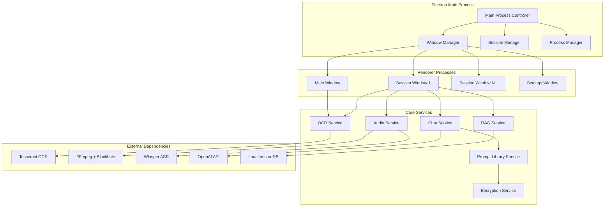

# Design Document

## Overview

The Interview Assistance application is an Electron-based desktop application that provides invisible, real-time support during interviews. The system architecture emphasizes stealth operation, real-time processing, and modular design to handle OCR, audio transcription, AI integration, and knowledge augmentation through RAG.

## Architecture

### High-Level Architecture



### Process Architecture

The application uses a multi-process architecture with stealth capabilities:

- **Main Process**: Manages windows, sessions, and core services
- **Renderer Processes**: Handle UI for main window, session windows, and settings
- **Hidden Process Identity**: Process appears as "systemAssistance" in system monitors

## Components and Interfaces

### 1. Window Manager

**Purpose**: Manages multiple window instances with stealth capabilities

**Key Methods**:
```typescript
interface WindowManager {
  createMainWindow(): BrowserWindow;
  createSessionWindow(sessionId: string, config: SessionConfig): BrowserWindow;
  hideWindow(windowId: string): void;
  showWindow(windowId: string): void;
  toggleVisibility(windowId: string): void;
  removeDockIcon(): void;
  restoreDockIcon(): void;
}
```

**Stealth Features**:
- Frameless windows with custom controls
- Dock icon removal on hide
- Always-on-top positioning
- Screen sharing exclusion flags

### 2. Session Manager

**Purpose**: Manages multiple independent interview sessions

**Key Methods**:
```typescript
interface SessionManager {
  createSession(config: SessionConfig): Session;
  getSession(sessionId: string): Session;
  closeSession(sessionId: string): void;
  listActiveSessions(): Session[];
}

interface Session {
  id: string;
  profession: string;
  interviewType: string;
  chatHistory: ChatMessage[];
  isRecording: boolean;
  ragContext: string[];
}
```

**Session Isolation**:
- Independent chat histories
- Separate prompt contexts
- Isolated audio recording states
- Individual RAG knowledge bases

### 3. OCR Service

**Purpose**: Captures screenshots and extracts text using Tesseract

**Key Methods**:
```typescript
interface OCRService {
  captureActiveWindow(): Promise<Buffer>;
  extractText(imageBuffer: Buffer): Promise<string>;
  processScreenshot(sessionId: string): Promise<string>;
}
```

**Implementation Details**:
- Uses native screen capture APIs
- Tesseract.js for client-side OCR
- Image preprocessing for better accuracy
- Error handling for capture failures

### 4. Audio Service

**Purpose**: Handles multi-source audio recording and transcription

**Key Methods**:
```typescript
interface AudioService {
  startRecording(source: AudioSource, sessionId: string): void;
  stopRecording(sessionId: string): void;
  processAudioSegment(audioBuffer: Buffer): Promise<string>;
  getTranscript(sessionId: string): string;
}

enum AudioSource {
  INTERVIEWER = 'internal',
  INTERVIEWEE = 'microphone',
  BOTH = 'both'
}
```

**Technical Implementation**:
- FFmpeg for internal audio capture via Blackhole
- Native microphone APIs
- 5-second segmented processing
- Whisper.cpp for local transcription
- Async processing pipeline

### 5. Chat Service

**Purpose**: Manages AI conversations with context-aware prompting

**Key Methods**:
```typescript
interface ChatService {
  sendMessage(sessionId: string, message: string): Promise<string>;
  processOCRText(sessionId: string, text: string, action: ActionType): Promise<string>;
  processTranscript(sessionId: string, transcript: string, source: AudioSource): Promise<string>;
  getConversationHistory(sessionId: string): ChatMessage[];
}

enum ActionType {
  SCREENSHOT = 'screenshot',
  DEBUG = 'debug',
  GENERAL = 'general'
}
```

**Context Management**:
- Session-specific conversation history
- Prompt template resolution
- RAG context injection
- Token limit management

### 6. RAG Service

**Purpose**: Manages local knowledge base and retrieval

**Key Methods**:
```typescript
interface RAGService {
  ingestDocuments(folderPath: string, sessionId: string): Promise<void>;
  searchRelevantContent(query: string, sessionId: string): Promise<string[]>;
  buildEmbeddings(documents: Document[]): Promise<void>;
  getKnowledgeBase(sessionId: string): KnowledgeBase;
}
```

**Storage Architecture**:
- SQLite for metadata and document storage
- FAISS for vector similarity search
- Local embeddings using sentence-transformers
- Per-session knowledge isolation

### 7. Prompt Library Service

**Purpose**: Manages dynamic prompt templates with personalization

**Key Methods**:
```typescript
interface PromptLibraryService {
  getSystemPrompt(profession: string, interviewType: string): string;
  getActionPrompt(action: ActionType, profession: string, interviewType: string): string;
  savePromptTemplate(template: PromptTemplate): void;
  resolveTemplate(template: string, variables: Record<string, string>): string;
}

interface PromptTemplate {
  id: string;
  profession: string;
  interviewType: string;
  action: ActionType;
  template: string;
  variables: string[];
}
```

**Template Structure**:
```typescript
// Example template with variables
const template = `You are a senior {profession} interviewer assistant.
Interview type: {interview_type}
Complexity level: {complexity_level}
Context: {context}

{action_specific_instructions}`;
```

## Data Models

### Configuration Data

```typescript
interface AppConfig {
  apiKey: string; // AES-256 encrypted
  promptLibrary: PromptLibrary;
  userPreferences: UserPreferences;
  sessions: SessionConfig[];
}

interface PromptLibrary {
  [professionKey: string]: {
    [interviewTypeKey: string]: {
      system: string;
      actions: {
        [actionKey: string]: string;
      };
    };
  };
}

interface UserPreferences {
  defaultProfession: string;
  defaultInterviewType: string;
  audioQuality: 'low' | 'medium' | 'high';
  ocrLanguage: string;
  maxSessions: number;
}
```

### Session Data

```typescript
interface SessionConfig {
  id: string;
  profession: string;
  interviewType: string;
  createdAt: Date;
  isActive: boolean;
}

interface ChatMessage {
  id: string;
  sessionId: string;
  role: 'user' | 'assistant';
  content: string;
  timestamp: Date;
  metadata?: {
    action?: ActionType;
    source?: AudioSource;
    ocrText?: string;
  };
}
```

### RAG Data

```typescript
interface Document {
  id: string;
  sessionId: string;
  filename: string;
  content: string;
  embedding: number[];
  metadata: {
    fileType: string;
    uploadDate: Date;
    pageCount?: number;
  };
}

interface KnowledgeBase {
  sessionId: string;
  documents: Document[];
  vectorIndex: any; // FAISS index
  lastUpdated: Date;
}
```

## Error Handling

### Error Categories

1. **System Errors**: Permission denied, file access issues
2. **Network Errors**: API failures, connectivity issues
3. **Processing Errors**: OCR failures, audio processing issues
4. **User Errors**: Invalid inputs, configuration issues

### Error Handling Strategy

```typescript
interface ErrorHandler {
  handleOCRError(error: OCRError): void;
  handleAudioError(error: AudioError): void;
  handleAPIError(error: APIError): void;
  handleSystemError(error: SystemError): void;
}

class GracefulErrorHandler implements ErrorHandler {
  handleOCRError(error: OCRError): void {
    // Log error, show user-friendly message, offer retry
    this.showErrorDialog('Screenshot capture failed. Please try again.');
    this.logError('OCR', error);
  }
  
  handleAPIError(error: APIError): void {
    // Implement retry logic with exponential backoff
    if (error.retryable) {
      this.retryWithBackoff(error.operation);
    } else {
      this.showErrorDialog('API service unavailable. Please check your connection.');
    }
  }
}
```

### Recovery Mechanisms

- **Auto-retry**: Network requests with exponential backoff
- **Graceful degradation**: Continue operation with reduced functionality
- **State persistence**: Save session state before crashes
- **Auto-restart**: Restart application and restore sessions

## Testing Strategy

### Unit Testing

- **Service Layer**: Mock external dependencies (Tesseract, Whisper, OpenAI)
- **Utility Functions**: Encryption, prompt resolution, data validation
- **Data Models**: Serialization, validation, transformation

### Integration Testing

- **OCR Pipeline**: Screenshot → OCR → Text extraction
- **Audio Pipeline**: Recording → Segmentation → Transcription
- **Chat Pipeline**: Message → Prompt resolution → API call → Response
- **RAG Pipeline**: Document ingestion → Embedding → Retrieval

### End-to-End Testing

- **Session Workflow**: Create session → Perform actions → Verify results
- **Multi-session**: Multiple concurrent sessions with different configurations
- **Stealth Mode**: Verify invisibility in screen sharing scenarios
- **Error Recovery**: Simulate failures and verify graceful handling

### Performance Testing

- **OCR Latency**: Measure screenshot to text extraction time (target: <2s)
- **Audio Processing**: Measure segment transcription time (target: <3s)
- **Memory Usage**: Monitor memory consumption with multiple sessions
- **Startup Time**: Application launch and session creation performance

## Security Considerations

### Data Protection

- **Encryption at Rest**: AES-256 for configuration and sensitive data
- **No External Logging**: All processing happens locally
- **Memory Management**: Clear sensitive data from memory after use
- **Secure Storage**: Use OS keychain for API keys when possible

### Privacy Measures

- **Local Processing**: OCR, transcription, and embeddings done locally
- **Minimal Data Retention**: Clear chat history on session close (optional)
- **Permission Management**: Explicit user consent for microphone and screen access
- **Network Isolation**: Only outbound API calls, no incoming connections

### Access Control

- **Process Isolation**: Separate processes for different functions
- **File System Permissions**: Restrict access to configuration files
- **API Key Protection**: Never log or expose API keys in plain text
- **Audit Trail**: Log security-relevant events (without sensitive data)

## Performance Optimizations

### OCR Optimization

- **Image Preprocessing**: Enhance contrast and resolution before OCR
- **Region of Interest**: Focus OCR on relevant screen areas
- **Caching**: Cache OCR results for identical screenshots
- **Parallel Processing**: Process multiple screenshots concurrently

### Audio Optimization

- **Streaming Processing**: Process audio segments as they're recorded
- **Compression**: Use efficient audio codecs for storage
- **Buffer Management**: Optimize buffer sizes for low latency
- **Background Processing**: Transcribe segments in background threads

### Memory Management

- **Session Cleanup**: Automatically clean up closed sessions
- **Resource Pooling**: Reuse expensive objects (OCR engines, audio processors)
- **Garbage Collection**: Explicit cleanup of large objects
- **Memory Monitoring**: Track and alert on excessive memory usage

## Deployment Architecture

### Application Packaging

- **Electron Builder**: Package for macOS with proper code signing
- **Process Name**: Configure binary name as "systemAssistance"
- **Auto-updater**: Implement secure update mechanism
- **Dependencies**: Bundle all required native dependencies

### Installation Requirements

- **macOS Version**: Minimum macOS 12 (Monterey)
- **Permissions**: Screen recording, microphone access
- **Dependencies**: Blackhole audio driver for internal audio capture
- **Storage**: Minimum 500MB for application and models

### Configuration Management

- **Default Settings**: Sensible defaults for first-time users
- **Migration**: Handle configuration updates between versions
- **Backup**: Automatic backup of user configurations
- **Reset**: Option to reset to factory defaults