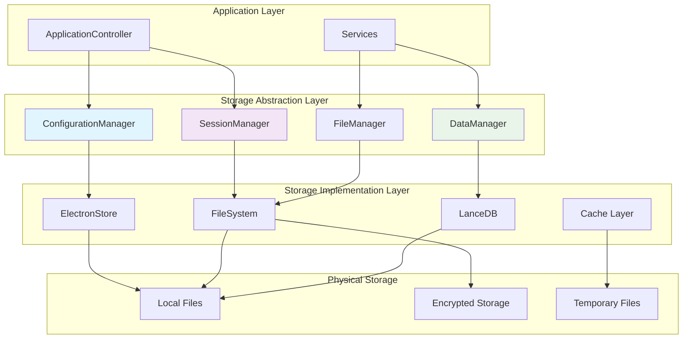

# GhostGuide Configuration and Data Persistence Documentation

## Table of Contents

1. [Overview](#overview)
2. [Data Storage Architecture](#data-storage-architecture)
3. [Configuration Management](#configuration-management)
4. [Session Data Persistence](#session-data-persistence)
5. [Chat History Storage](#chat-history-storage)
6. [RAG Data Persistence](#rag-data-persistence)
7. [Audio Data Management](#audio-data-management)
8. [OCR Data Storage](#ocr-data-storage)
9. [Logging and Analytics](#logging-and-analytics)
10. [Data Migration and Versioning](#data-migration-and-versioning)
11. [Backup and Recovery](#backup-and-recovery)
12. [Security and Encryption](#security-and-encryption)
13. [Performance Optimization](#performance-optimization)
14. [Data Cleanup and Maintenance](#data-cleanup-and-maintenance)

---

## Overview

GhostGuide implements a comprehensive data persistence strategy that handles configuration, session data, chat history, knowledge bases, and various types of user-generated content. The system is designed for reliability, security, and performance across different operating systems.

### Storage Principles

- **Data Integrity**: All data operations use atomic writes and validation
- **Security**: Sensitive data is encrypted at rest
- **Performance**: Efficient storage and retrieval with caching layers
- **Portability**: Data can be easily backed up and restored
- **Scalability**: Storage grows efficiently with usage
- **Privacy**: User data is stored locally with optional cloud backup

### Data Types Managed

1. **Application Configuration**: Settings, preferences, API keys
2. **Session Data**: Interview session state and metadata  
3. **Chat History**: Conversation logs with AI
4. **RAG Data**: Vector databases and knowledge bases
5. **Audio Files**: Recording data and transcriptions
6. **OCR Results**: Screenshot text extraction results
7. **Logs**: Application and error logs
8. **Cache Data**: Temporary performance optimizations

---

## Data Storage Architecture

### Storage Directory Structure

```
~/Library/Application Support/GhostGuide/  (macOS)
%APPDATA%/GhostGuide/                      (Windows)  
~/.config/GhostGuide/                      (Linux)
├── config.json                           # Main configuration
├── sessions/                             # Session data
│   ├── {sessionId}.json                  # Individual session files
│   └── index.json                        # Session index
├── chat-history/                         # Chat conversations
│   ├── {sessionId}/                      # Per-session chat logs
│   │   ├── messages.json                 # Chat messages
│   │   └── metadata.json                 # Chat metadata
│   └── global/                           # Global chat data
├── rag/                                  # RAG knowledge bases
│   ├── global/                           # Global RAG database
│   │   ├── vector.db                     # LanceDB vector store
│   │   ├── documents.json                # Document metadata
│   │   └── embeddings.json               # Embedding cache
│   └── sessions/                         # Session-specific RAG
│       └── {sessionId}/                  # Per-session RAG data
├── audio/                                # Audio recordings
│   ├── recordings/                       # Raw recordings
│   │   └── {sessionId}/                  # Per-session recordings
│   ├── transcripts/                      # Transcription results
│   └── cache/                            # Audio processing cache
├── ocr/                                  # OCR data
│   ├── screenshots/                      # Screenshot images
│   ├── results/                          # OCR text results
│   └── cache/                            # OCR processing cache
├── logs/                                 # Application logs
│   ├── app.log                           # Main application log
│   ├── error.log                         # Error log
│   └── performance.log                   # Performance metrics
└── temp/                                 # Temporary files
    ├── processing/                       # File processing temp
    └── cache/                            # Temporary cache files
```

### Storage Layer Architecture



---

## Configuration Management

### Configuration Schema

```typescript
interface ApplicationConfig {
    version: string
    stealthMode: boolean
    debug: boolean
    logLevel: 'debug' | 'info' | 'warn' | 'error'
    
    // API Configuration
    openai?: {
        apiKey?: string
        model: string
        maxTokens: number
        temperature: number
    }
    
    // Audio Configuration
    audio?: {
        ffmpegPath?: string
        whisperPath?: string
        devices: {
            microphone?: string
            systemAudio?: string
        }
        quality: 'low' | 'medium' | 'high'
        maxRecordingDuration: number
    }
    
    // OCR Configuration
    ocr?: {
        language: string
        engineMode: number
        preprocessing: boolean
    }
    
    // RAG Configuration
    rag?: {
        embeddingModel: string
        chunkSize: number
        maxResults: number
    }
    
    // UI Configuration
    ui?: {
        theme: 'light' | 'dark' | 'system'
        fontSize: number
        windowSize: {
            width: number
            height: number
        }
    }
    
    // Privacy and Security
    privacy?: {
        enableTelemetry: boolean
        autoSaveChats: boolean
        retainDataDays: number
    }
    
    // Performance
    performance?: {
        cacheSize: number
        maxConcurrentOperations: number
        enableHardwareAcceleration: boolean
    }
}
```

### ConfigurationManager Implementation

```typescript
class ConfigurationManager {
    private config: ApplicationConfig
    private store: Store
    private configPath: string
    private encryptionKey?: Buffer
    
    constructor() {
        this.store = new Store({
            name: 'ghost-guide-config',
            schema: this.getConfigSchema()
        })
        this.configPath = path.join(app.getPath('userData'), 'config.json')
    }
    
    async initialize(): Promise<void> {
        await this.loadConfiguration()
        await this.validateConfiguration()
        await this.migrateConfigurationIfNeeded()
        await this.setupEncryption()
    }
    
    async loadConfiguration(): Promise<ApplicationConfig> {
        try {
            // Try loading from encrypted file first
            if (await this.hasEncryptedConfig()) {
                this.config = await this.loadEncryptedConfig()
            } else {
                // Fallback to plain JSON or Electron Store
                this.config = await this.loadPlainConfig()
            }
            
            // Merge with defaults
            this.config = this.mergeWithDefaults(this.config)
            
            return this.config
        } catch (error) {
            console.warn('Failed to load configuration, using defaults:', error)
            this.config = this.getDefaultConfiguration()
            await this.saveConfiguration()
            return this.config
        }
    }
    
    async saveConfiguration(): Promise<void> {
        const configToSave = { ...this.config }
        
        // Remove sensitive data before saving to plain storage
        delete configToSave.openai?.apiKey
        
        // Save to multiple locations for redundancy
        await this.saveToFile(configToSave)
        await this.saveToStore(configToSave)
        
        // Save sensitive data encrypted
        if (this.config.openai?.apiKey) {
            await this.saveEncryptedData({
                apiKey: this.config.openai.apiKey
            })
        }
        
        this.emit('configuration-changed', this.config)
    }
    
    private async saveToFile(config: ApplicationConfig): Promise<void> {
        const tempPath = `${this.configPath}.tmp`
        
        // Atomic write pattern
        await fs.writeFile(tempPath, JSON.stringify(config, null, 2), 'utf8')
        await fs.rename(tempPath, this.configPath)
    }
    
    private async saveToStore(config: ApplicationConfig): Promise<void> {
        Object.entries(config).forEach(([key, value]) => {
            this.store.set(key, value)
        })
    }
    
    // API Key Management
    async updateApiKey(apiKey: string): Promise<void> {
        // Validate API key format
        if (!this.isValidApiKey(apiKey)) {
            throw new Error('Invalid API key format')
        }
        
        // Test API key
        await this.testApiKey(apiKey)
        
        // Update configuration
        if (!this.config.openai) this.config.openai = {} as any
        this.config.openai.apiKey = apiKey
        
        // Save encrypted
        await this.saveConfiguration()
    }
    
    private async testApiKey(apiKey: string): Promise<void> {
        const testClient = new OpenAI({ apiKey })
        await testClient.models.list() // Test API connection
    }
    
    // Configuration Validation
    private async validateConfiguration(): Promise<void> {
        const errors: string[] = []
        
        if (!this.config.version) {
            errors.push('Configuration version is required')
        }
        
        if (this.config.openai?.apiKey && !this.isValidApiKey(this.config.openai.apiKey)) {
            errors.push('Invalid OpenAI API key')
        }
        
        if (this.config.audio?.maxRecordingDuration && this.config.audio.maxRecordingDuration < 60) {
            errors.push('Max recording duration must be at least 60 seconds')
        }
        
        if (errors.length > 0) {
            throw new ConfigurationError(errors.join(', '))
        }
    }
    
    private getDefaultConfiguration(): ApplicationConfig {
        return {
            version: '1.0.0',
            stealthMode: true,
            debug: false,
            logLevel: 'info',
            openai: {
                model: 'gpt-4',
                maxTokens: 1000,
                temperature: 0.3
            },
            audio: {
                quality: 'medium',
                maxRecordingDuration: 3600
            },
            ocr: {
                language: 'eng',
                engineMode: 1,
                preprocessing: true
            },
            rag: {
                embeddingModel: 'text-embedding-3-small',
                chunkSize: 1000,
                maxResults: 10
            },
            ui: {
                theme: 'system',
                fontSize: 14,
                windowSize: {
                    width: 1200,
                    height: 800
                }
            },
            privacy: {
                enableTelemetry: false,
                autoSaveChats: true,
                retainDataDays: 30
            },
            performance: {
                cacheSize: 100,
                maxConcurrentOperations: 3,
                enableHardwareAcceleration: true
            }
        }
    }
}
```

### Configuration Migration

```typescript
class ConfigurationMigrator {
    private migrations: Map<string, (config: any) => any> = new Map()
    
    constructor() {
        this.setupMigrations()
    }
    
    private setupMigrations(): void {
        // Version 1.0.0 -> 1.1.0
        this.migrations.set('1.1.0', (config) => ({
            ...config,
            version: '1.1.0',
            ui: {
                ...config.ui,
                theme: config.ui?.theme || 'system'
            }
        }))
        
        // Version 1.1.0 -> 1.2.0
        this.migrations.set('1.2.0', (config) => ({
            ...config,
            version: '1.2.0',
            performance: {
                cacheSize: 100,
                maxConcurrentOperations: 3,
                enableHardwareAcceleration: true
            }
        }))
    }
    
    async migrate(config: ApplicationConfig, targetVersion: string): Promise<ApplicationConfig> {
        const currentVersion = config.version || '1.0.0'
        const versions = this.getVersionsBetween(currentVersion, targetVersion)
        
        let migratedConfig = { ...config }
        
        for (const version of versions) {
            const migration = this.migrations.get(version)
            if (migration) {
                migratedConfig = migration(migratedConfig)
                console.log(`Migrated configuration to version ${version}`)
            }
        }
        
        return migratedConfig
    }
    
    private getVersionsBetween(fromVersion: string, toVersion: string): string[] {
        // Implementation to determine migration path
        const allVersions = Array.from(this.migrations.keys()).sort()
        return allVersions.filter(v => 
            this.compareVersions(v, fromVersion) > 0 && 
            this.compareVersions(v, toVersion) <= 0
        )
    }
}
```

---

## Session Data Persistence

### Session Data Model

```typescript
interface Session {
    id: string                              // UUID
    version: string                         // Data format version
    createdAt: Date                         // Creation timestamp
    updatedAt: Date                         // Last update timestamp
    
    // Session Configuration
    profession: string                      // User's profession
    interviewType: string                   // Type of interview
    context?: string                        // Additional context
    
    // Session State
    isActive: boolean                       // Currently active session
    isRecording: boolean                    // Audio recording status
    hasRAG: boolean                         // Has RAG documents
    recordingSource?: AudioSource           // Current recording source
    
    // Data References
    chatHistoryPath: string                 // Path to chat history
    audioDataPath?: string                  // Path to audio data
    ragDataPath?: string                    // Path to RAG data
    ocrDataPath?: string                    // Path to OCR data
    
    // Accumulated Data
    accumulatedOCR?: Record<string, string> // Temporary OCR accumulation
    
    // Metadata
    tags: string[]                          // User-defined tags
    notes?: string                          // User notes
    rating?: number                         // User rating (1-5)
    
    // Statistics
    stats: {
        messagesExchanged: number           // Total chat messages
        recordingDuration: number           // Total recording time (ms)
        screenshotsTaken: number            // Screenshots captured
        documentsIngested: number           // RAG documents added
    }
}
```

### SessionManager Implementation

```typescript
class SessionManager {
    private sessions: Map<string, Session> = new Map()
    private sessionIndex: SessionIndex
    private dataPath: string
    
    constructor() {
        this.dataPath = path.join(app.getPath('userData'), 'sessions')
        this.sessionIndex = new SessionIndex(this.dataPath)
    }
    
    async initialize(): Promise<void> {
        await this.ensureDirectoryStructure()
        await this.loadSessionIndex()
        await this.loadActiveSessions()
    }
    
    async createSession(config: SessionConfig): Promise<Session> {
        const session: Session = {
            id: uuidv4(),
            version: '1.0.0',
            createdAt: new Date(),
            updatedAt: new Date(),
            profession: config.profession,
            interviewType: config.interviewType,
            context: config.context,
            isActive: true,
            isRecording: false,
            hasRAG: false,
            chatHistoryPath: this.getChatHistoryPath(sessionId),
            tags: [],
            stats: {
                messagesExchanged: 0,
                recordingDuration: 0,
                screenshotsTaken: 0,
                documentsIngested: 0
            }
        }
        
        // Create session directory structure
        await this.createSessionDirectories(session.id)
        
        // Save session data
        await this.persistSession(session)
        
        // Update index
        await this.sessionIndex.addSession(session)
        
        // Cache in memory
        this.sessions.set(session.id, session)
        
        return session
    }
    
    async persistSession(session: Session): Promise<void> {
        session.updatedAt = new Date()
        
        const sessionPath = this.getSessionPath(session.id)
        const tempPath = `${sessionPath}.tmp`
        
        try {
            // Atomic write
            await fs.writeFile(tempPath, JSON.stringify(session, null, 2), 'utf8')
            await fs.rename(tempPath, sessionPath)
            
            // Update in-memory cache
            this.sessions.set(session.id, session)
            
            // Update index
            await this.sessionIndex.updateSession(session)
            
        } catch (error) {
            // Clean up temp file on error
            try {
                await fs.unlink(tempPath)
            } catch {}
            throw new Error(`Failed to persist session: ${error.message}`)
        }
    }
    
    async loadSession(sessionId: string): Promise<Session | null> {
        // Check memory cache first
        if (this.sessions.has(sessionId)) {
            return this.sessions.get(sessionId)!
        }
        
        const sessionPath = this.getSessionPath(sessionId)
        
        try {
            const data = await fs.readFile(sessionPath, 'utf8')
            const session: Session = JSON.parse(data)
            
            // Validate session data
            await this.validateSession(session)
            
            // Migrate if needed
            const migratedSession = await this.migrateSessionIfNeeded(session)
            
            // Cache in memory
            this.sessions.set(sessionId, migratedSession)
            
            return migratedSession
        } catch (error) {
            console.error(`Failed to load session ${sessionId}:`, error)
            return null
        }
    }
    
    async closeSession(sessionId: string): Promise<void> {
        const session = await this.getSession(sessionId)
        if (!session) return
        
        // Update session state
        session.isActive = false
        session.isRecording = false
        session.recordingSource = undefined
        
        // Clean up temporary data
        await this.cleanupSessionTempData(sessionId)
        
        // Save final state
        await this.persistSession(session)
        
        // Remove from memory cache
        this.sessions.delete(sessionId)
    }
    
    private async createSessionDirectories(sessionId: string): Promise<void> {
        const baseDir = path.join(this.dataPath, sessionId)
        
        const directories = [
            baseDir,
            path.join(baseDir, 'chat'),
            path.join(baseDir, 'audio'),
            path.join(baseDir, 'ocr'),
            path.join(baseDir, 'rag'),
            path.join(baseDir, 'temp')
        ]
        
        for (const dir of directories) {
            await fs.mkdir(dir, { recursive: true })
        }
    }
    
    private getSessionPath(sessionId: string): string {
        return path.join(this.dataPath, sessionId, 'session.json')
    }
    
    private getChatHistoryPath(sessionId: string): string {
        return path.join(this.dataPath, sessionId, 'chat', 'messages.json')
    }
}
```

### Session Index Management

```typescript
interface SessionIndex {
    version: string
    sessions: SessionIndexEntry[]
    lastUpdated: Date
}

interface SessionIndexEntry {
    id: string
    profession: string
    interviewType: string
    createdAt: Date
    updatedAt: Date
    isActive: boolean
    tags: string[]
    stats: SessionStats
}

class SessionIndexManager {
    private index: SessionIndex
    private indexPath: string
    
    constructor(dataPath: string) {
        this.indexPath = path.join(dataPath, 'index.json')
    }
    
    async loadIndex(): Promise<SessionIndex> {
        try {
            const data = await fs.readFile(this.indexPath, 'utf8')
            this.index = JSON.parse(data)
            return this.index
        } catch (error) {
            // Create new index if doesn't exist
            this.index = {
                version: '1.0.0',
                sessions: [],
                lastUpdated: new Date()
            }
            await this.saveIndex()
            return this.index
        }
    }
    
    async addSession(session: Session): Promise<void> {
        const entry: SessionIndexEntry = {
            id: session.id,
            profession: session.profession,
            interviewType: session.interviewType,
            createdAt: session.createdAt,
            updatedAt: session.updatedAt,
            isActive: session.isActive,
            tags: session.tags,
            stats: session.stats
        }
        
        this.index.sessions.push(entry)
        this.index.lastUpdated = new Date()
        
        await this.saveIndex()
    }
    
    async updateSession(session: Session): Promise<void> {
        const entryIndex = this.index.sessions.findIndex(s => s.id === session.id)
        
        if (entryIndex !== -1) {
            this.index.sessions[entryIndex] = {
                id: session.id,
                profession: session.profession,
                interviewType: session.interviewType,
                createdAt: session.createdAt,
                updatedAt: session.updatedAt,
                isActive: session.isActive,
                tags: session.tags,
                stats: session.stats
            }
            
            this.index.lastUpdated = new Date()
            await this.saveIndex()
        }
    }
    
    async searchSessions(query: SessionSearchQuery): Promise<SessionIndexEntry[]> {
        let results = [...this.index.sessions]
        
        // Filter by profession
        if (query.profession) {
            results = results.filter(s => 
                s.profession.toLowerCase().includes(query.profession!.toLowerCase())
            )
        }
        
        // Filter by interview type
        if (query.interviewType) {
            results = results.filter(s => 
                s.interviewType.toLowerCase().includes(query.interviewType!.toLowerCase())
            )
        }
        
        // Filter by date range
        if (query.dateFrom) {
            results = results.filter(s => s.createdAt >= query.dateFrom!)
        }
        
        if (query.dateTo) {
            results = results.filter(s => s.createdAt <= query.dateTo!)
        }
        
        // Filter by tags
        if (query.tags && query.tags.length > 0) {
            results = results.filter(s => 
                query.tags!.some(tag => s.tags.includes(tag))
            )
        }
        
        // Sort by creation date (newest first)
        results.sort((a, b) => b.createdAt.getTime() - a.createdAt.getTime())
        
        // Apply limit
        if (query.limit) {
            results = results.slice(0, query.limit)
        }
        
        return results
    }
    
    private async saveIndex(): Promise<void> {
        const tempPath = `${this.indexPath}.tmp`
        
        await fs.writeFile(tempPath, JSON.stringify(this.index, null, 2), 'utf8')
        await fs.rename(tempPath, this.indexPath)
    }
}
```

---

## Chat History Storage

### Chat Data Model

```typescript
interface ChatMessage {
    id: string                      // Unique message ID
    sessionId: string               // Session reference
    role: 'system' | 'user' | 'assistant'
    content: string                 // Message content
    timestamp: Date                 // Message timestamp
    
    // Metadata
    source?: string                 // Message source (e.g., 'audio', 'screenshot')
    tokens?: {                      // Token usage (for AI messages)
        prompt: number
        completion: number
        total: number
    }
    
    // Processing info
    processingTime?: number         // Time to generate response (ms)
    model?: string                  // AI model used
    
    // User interaction
    rating?: number                 // User rating (1-5)
    feedback?: string               // User feedback
    bookmarked?: boolean            // User bookmarked
}

interface ChatSession {
    sessionId: string
    messages: ChatMessage[]
    metadata: {
        totalMessages: number
        totalTokens: number
        firstMessage: Date
        lastMessage: Date
        averageResponseTime: number
    }
}
```

### Chat History Manager

```typescript
class ChatHistoryManager {
    private historyCache: Map<string, ChatMessage[]> = new Map()
    private dataPath: string
    
    constructor() {
        this.dataPath = path.join(app.getPath('userData'), 'chat-history')
    }
    
    async initialize(): Promise<void> {
        await fs.mkdir(this.dataPath, { recursive: true })
    }
    
    async addMessage(message: ChatMessage): Promise<void> {
        // Add to cache
        if (!this.historyCache.has(message.sessionId)) {
            this.historyCache.set(message.sessionId, [])
        }
        
        const messages = this.historyCache.get(message.sessionId)!
        messages.push(message)
        
        // Persist to disk
        await this.saveChatHistory(message.sessionId)
        
        // Update session metadata
        await this.updateChatMetadata(message.sessionId)
    }
    
    async getChatHistory(sessionId: string): Promise<ChatMessage[]> {
        // Check cache first
        if (this.historyCache.has(sessionId)) {
            return this.historyCache.get(sessionId)!
        }
        
        // Load from disk
        const messages = await this.loadChatHistory(sessionId)
        this.historyCache.set(sessionId, messages)
        
        return messages
    }
    
    async saveChatHistory(sessionId: string): Promise<void> {
        const messages = this.historyCache.get(sessionId)
        if (!messages) return
        
        const chatPath = this.getChatPath(sessionId)
        const tempPath = `${chatPath}.tmp`
        
        // Ensure directory exists
        await fs.mkdir(path.dirname(chatPath), { recursive: true })
        
        try {
            // Atomic write
            await fs.writeFile(tempPath, JSON.stringify(messages, null, 2), 'utf8')
            await fs.rename(tempPath, chatPath)
        } catch (error) {
            await fs.unlink(tempPath).catch(() => {})
            throw new Error(`Failed to save chat history: ${error.message}`)
        }
    }
    
    private async loadChatHistory(sessionId: string): Promise<ChatMessage[]> {
        const chatPath = this.getChatPath(sessionId)
        
        try {
            const data = await fs.readFile(chatPath, 'utf8')
            const messages: ChatMessage[] = JSON.parse(data)
            
            // Validate and migrate messages if needed
            return messages.map(msg => this.validateAndMigrateMessage(msg))
        } catch (error) {
            // File doesn't exist or is corrupted
            return []
        }
    }
    
    async exportChatHistory(sessionId: string, format: 'json' | 'txt' | 'md'): Promise<string> {
        const messages = await this.getChatHistory(sessionId)
        
        switch (format) {
            case 'json':
                return JSON.stringify(messages, null, 2)
            
            case 'txt':
                return messages.map(msg => 
                    `[${msg.timestamp.toISOString()}] ${msg.role}: ${msg.content}`
                ).join('\n\n')
            
            case 'md':
                return messages.map(msg => {
                    const time = msg.timestamp.toLocaleString()
                    const role = msg.role.charAt(0).toUpperCase() + msg.role.slice(1)
                    return `## ${role} (${time})\n\n${msg.content}\n\n---\n`
                }).join('')
            
            default:
                throw new Error(`Unsupported export format: ${format}`)
        }
    }
    
    async compressChatHistory(sessionId: string): Promise<void> {
        const messages = await this.getChatHistory(sessionId)
        
        if (messages.length > 100) {
            // Keep system message + recent messages
            const systemMessage = messages.find(msg => msg.role === 'system')
            const recentMessages = messages.slice(-50)
            
            const compressedMessages = [
                ...(systemMessage ? [systemMessage] : []),
                {
                    id: uuidv4(),
                    sessionId,
                    role: 'system' as const,
                    content: `[Previous conversation history compressed - ${messages.length - recentMessages.length - (systemMessage ? 1 : 0)} messages omitted]`,
                    timestamp: new Date()
                },
                ...recentMessages
            ]
            
            this.historyCache.set(sessionId, compressedMessages)
            await this.saveChatHistory(sessionId)
        }
    }
    
    private getChatPath(sessionId: string): string {
        return path.join(this.dataPath, sessionId, 'messages.json')
    }
}
```

---

## RAG Data Persistence

### RAG Data Models

```typescript
interface Document {
    id: string                      // Unique document ID
    title: string                   // Document title
    content: string                 // Full document content
    chunks: DocumentChunk[]         // Text chunks
    metadata: DocumentMetadata      // Document metadata
    createdAt: Date                 // Creation timestamp
    updatedAt: Date                 // Last update timestamp
}

interface DocumentChunk {
    id: string                      // Unique chunk ID
    documentId: string              // Parent document ID
    content: string                 // Chunk content
    startIndex: number              // Start position in original
    endIndex: number                // End position in original
    embedding?: number[]            // Vector embedding
    metadata: ChunkMetadata         // Chunk-specific metadata
}

interface DocumentMetadata {
    filename: string                // Original filename
    filePath: string                // Original file path
    fileType: string                // File type (pdf, txt, md)
    fileSize: number                // File size in bytes
    language: string                // Detected language
    profession?: string             // Related profession
    tags: string[]                  // User-defined tags
    sessionId?: string              // Associated session
}

interface VectorDatabase {
    version: string
    documents: Map<string, Document>
    embeddings: Map<string, number[]>
    metadata: {
        totalDocuments: number
        totalChunks: number
        lastUpdated: Date
        embeddingModel: string
    }
}
```

### RAG Data Manager

```typescript
class RAGDataManager {
    private globalDB: LanceDB
    private sessionDBs: Map<string, LocalKnowledgeBase> = new Map()
    private dataPath: string
    
    constructor() {
        this.dataPath = path.join(app.getPath('userData'), 'rag')
    }
    
    async initialize(): Promise<void> {
        await this.setupDirectories()
        await this.initializeGlobalDatabase()
        await this.loadExistingSessionDatabases()
    }
    
    // Global RAG Database
    async initializeGlobalDatabase(): Promise<void> {
        const dbPath = path.join(this.dataPath, 'global')
        await fs.mkdir(dbPath, { recursive: true })
        
        try {
            // Connect to existing database
            this.globalDB = await LanceDB.connect(dbPath)
        } catch (error) {
            // Create new database
            this.globalDB = await this.createGlobalDatabase(dbPath)
        }
    }
    
    async addGlobalDocument(content: string, metadata: DocumentMetadata): Promise<string> {
        const document: Document = {
            id: uuidv4(),
            title: metadata.filename || 'Untitled',
            content,
            chunks: [],
            metadata,
            createdAt: new Date(),
            updatedAt: new Date()
        }
        
        // Create chunks
        document.chunks = await this.createChunks(document)
        
        // Generate embeddings
        await this.generateEmbeddings(document)
        
        // Store in vector database
        await this.storeInGlobalDatabase(document)
        
        // Save metadata
        await this.saveGlobalDocumentMetadata(document)
        
        return document.id
    }
    
    async searchGlobal(query: string, limit: number = 5): Promise<SearchResult[]> {
        // Generate query embedding
        const queryEmbedding = await this.generateQueryEmbedding(query)
        
        // Search vector database
        const results = await this.globalDB.search(queryEmbedding, limit)
        
        return results.map(result => ({
            id: result.id,
            text: result.chunk_text,
            score: result.score,
            metadata: result.metadata
        }))
    }
    
    // Session-Specific RAG
    async createSessionDatabase(sessionId: string): Promise<void> {
        const sessionDBPath = path.join(this.dataPath, 'sessions', sessionId)
        await fs.mkdir(sessionDBPath, { recursive: true })
        
        const knowledgeBase = new LocalKnowledgeBase(sessionDBPath)
        await knowledgeBase.initialize()
        
        this.sessionDBs.set(sessionId, knowledgeBase)
    }
    
    async ingestSessionDocuments(sessionId: string, documentsPath: string): Promise<IngestionResult> {
        let knowledgeBase = this.sessionDBs.get(sessionId)
        
        if (!knowledgeBase) {
            await this.createSessionDatabase(sessionId)
            knowledgeBase = this.sessionDBs.get(sessionId)!
        }
        
        return await knowledgeBase.ingestDocuments(documentsPath)
    }
    
    private async createChunks(document: Document): Promise<DocumentChunk[]> {
        const chunks: DocumentChunk[] = []
        const chunkSize = 1000
        const overlapSize = 200
        
        let startIndex = 0
        let chunkIndex = 0
        
        while (startIndex < document.content.length) {
            const endIndex = Math.min(startIndex + chunkSize, document.content.length)
            const chunkContent = document.content.slice(startIndex, endIndex)
            
            const chunk: DocumentChunk = {
                id: `${document.id}-chunk-${chunkIndex}`,
                documentId: document.id,
                content: chunkContent,
                startIndex,
                endIndex,
                metadata: {
                    chunkIndex,
                    wordCount: chunkContent.split(/\s+/).length,
                    characterCount: chunkContent.length
                }
            }
            
            chunks.push(chunk)
            
            startIndex += chunkSize - overlapSize
            chunkIndex++
        }
        
        return chunks
    }
    
    private async generateEmbeddings(document: Document): Promise<void> {
        // Generate embeddings for each chunk
        for (const chunk of document.chunks) {
            if (this.openai) {
                try {
                    const response = await this.openai.embeddings.create({
                        model: 'text-embedding-3-small',
                        input: chunk.content
                    })
                    
                    chunk.embedding = response.data[0].embedding
                } catch (error) {
                    console.warn(`Failed to generate embedding for chunk ${chunk.id}:`, error)
                    // Use local embedding as fallback
                    chunk.embedding = await this.generateLocalEmbedding(chunk.content)
                }
            } else {
                chunk.embedding = await this.generateLocalEmbedding(chunk.content)
            }
        }
    }
    
    // Backup and Export
    async exportGlobalDatabase(exportPath: string): Promise<void> {
        const exportData = {
            version: '1.0.0',
            exportDate: new Date(),
            documents: await this.getAllGlobalDocuments(),
            metadata: await this.getGlobalDatabaseMetadata()
        }
        
        await fs.writeFile(
            path.join(exportPath, 'global-rag-export.json'),
            JSON.stringify(exportData, null, 2),
            'utf8'
        )
        
        // Export vector database
        await this.globalDB.backup(path.join(exportPath, 'vector-db-backup'))
    }
    
    async importGlobalDatabase(importPath: string): Promise<void> {
        const importFile = path.join(importPath, 'global-rag-export.json')
        const data = JSON.parse(await fs.readFile(importFile, 'utf8'))
        
        // Validate import data
        this.validateImportData(data)
        
        // Import documents
        for (const document of data.documents) {
            await this.importDocument(document)
        }
        
        // Restore vector database if available
        const backupPath = path.join(importPath, 'vector-db-backup')
        if (await fs.access(backupPath).then(() => true).catch(() => false)) {
            await this.globalDB.restore(backupPath)
        }
    }
}
```

### Local Knowledge Base for Sessions

```typescript
class LocalKnowledgeBase {
    private documents: Map<string, Document> = new Map()
    private embeddings: Map<string, number[]> = new Map()
    private metadata: KnowledgeBaseMetadata
    private dbPath: string
    
    constructor(dbPath: string) {
        this.dbPath = dbPath
        this.metadata = {
            version: '1.0.0',
            totalDocuments: 0,
            totalChunks: 0,
            lastUpdated: new Date(),
            embeddingModel: 'local'
        }
    }
    
    async initialize(): Promise<void> {
        await fs.mkdir(this.dbPath, { recursive: true })
        await this.loadExistingData()
    }
    
    async ingestDocuments(documentsPath: string): Promise<IngestionResult> {
        const files = await this.scanForDocuments(documentsPath)
        const results: IngestionResult = {
            documentsProcessed: 0,
            documentsSkipped: 0,
            errors: []
        }
        
        for (const filePath of files) {
            try {
                await this.ingestSingleDocument(filePath)
                results.documentsProcessed++
            } catch (error) {
                results.documentsSkipped++
                results.errors.push({
                    file: filePath,
                    error: error.message
                })
            }
        }
        
        await this.saveData()
        return results
    }
    
    async search(query: string, limit: number = 5): Promise<SearchResult[]> {
        // Simple text-based search for local KB (could be enhanced with local embeddings)
        const results: SearchResult[] = []
        
        const normalizedQuery = query.toLowerCase()
        
        for (const [docId, document] of this.documents) {
            for (const chunk of document.chunks) {
                const normalizedContent = chunk.content.toLowerCase()
                
                if (normalizedContent.includes(normalizedQuery)) {
                    const score = this.calculateRelevanceScore(normalizedQuery, normalizedContent)
                    
                    results.push({
                        id: chunk.id,
                        text: chunk.content,
                        score,
                        metadata: {
                            documentId: docId,
                            documentTitle: document.title,
                            chunkIndex: chunk.metadata.chunkIndex
                        }
                    })
                }
            }
        }
        
        // Sort by relevance score and limit results
        return results
            .sort((a, b) => b.score - a.score)
            .slice(0, limit)
    }
    
    private async ingestSingleDocument(filePath: string): Promise<void> {
        const content = await this.extractTextFromFile(filePath)
        const metadata = await this.extractFileMetadata(filePath)
        
        const document: Document = {
            id: uuidv4(),
            title: path.basename(filePath),
            content,
            chunks: [],
            metadata,
            createdAt: new Date(),
            updatedAt: new Date()
        }
        
        // Create chunks
        document.chunks = await this.createDocumentChunks(document)
        
        // Store document
        this.documents.set(document.id, document)
        
        // Update metadata
        this.metadata.totalDocuments = this.documents.size
        this.metadata.totalChunks += document.chunks.length
        this.metadata.lastUpdated = new Date()
    }
    
    private async saveData(): Promise<void> {
        // Save documents
        const documentsPath = path.join(this.dbPath, 'documents.json')
        const documentsData = Array.from(this.documents.values())
        await fs.writeFile(documentsPath, JSON.stringify(documentsData, null, 2), 'utf8')
        
        // Save metadata
        const metadataPath = path.join(this.dbPath, 'metadata.json')
        await fs.writeFile(metadataPath, JSON.stringify(this.metadata, null, 2), 'utf8')
    }
}
```

---

## Audio Data Management

### Audio Data Models

```typescript
interface AudioRecording {
    id: string                      // Unique recording ID
    sessionId: string               // Associated session
    source: AudioSource             // Recording source
    startTime: Date                 // Recording start time
    endTime?: Date                  // Recording end time
    duration: number                // Duration in milliseconds
    
    // File Information
    filePath: string                // Path to audio file
    fileSize: number                // File size in bytes
    format: string                  // Audio format (wav, mp3, etc.)
    sampleRate: number              // Sample rate (Hz)
    channels: number                // Number of channels
    
    // Processing Results
    transcription?: AudioTranscription
    
    // Metadata
    quality: 'low' | 'medium' | 'high'
    metadata: {
        originalFilename?: string
        deviceName?: string
        processingTime?: number
        status: 'recording' | 'processing' | 'completed' | 'error'
        errorMessage?: string
    }
}

interface AudioTranscription {
    id: string                      // Unique transcription ID
    recordingId: string             // Associated recording
    text: string                    // Transcribed text
    confidence: number              // Confidence score (0-1)
    
    // Timing Information
    segments: TranscriptionSegment[]
    
    // Processing Details
    model: string                   // Whisper model used
    language: string                // Detected/specified language
    processingTime: number          // Processing time (ms)
    createdAt: Date                 // Transcription timestamp
}

interface TranscriptionSegment {
    id: string
    text: string
    startTime: number               // Segment start (ms)
    endTime: number                 // Segment end (ms)
    confidence: number              // Segment confidence
}
```

### Audio Data Manager

```typescript
class AudioDataManager {
    private recordings: Map<string, AudioRecording> = new Map()
    private transcriptions: Map<string, AudioTranscription> = new Map()
    private dataPath: string
    private tempPath: string
    
    constructor() {
        this.dataPath = path.join(app.getPath('userData'), 'audio')
        this.tempPath = path.join(this.dataPath, 'temp')
    }
    
    async initialize(): Promise<void> {
        await this.setupDirectories()
        await this.loadExistingRecordings()
        await this.cleanupOrphanedFiles()
    }
    
    async startRecording(sessionId: string, source: AudioSource): Promise<string> {
        const recordingId = uuidv4()
        const filename = `${sessionId}-${recordingId}-${Date.now()}.wav`
        const filePath = path.join(this.dataPath, 'recordings', filename)
        
        const recording: AudioRecording = {
            id: recordingId,
            sessionId,
            source,
            startTime: new Date(),
            duration: 0,
            filePath,
            fileSize: 0,
            format: 'wav',
            sampleRate: 16000,
            channels: 1,
            quality: 'medium',
            metadata: {
                status: 'recording'
            }
        }
        
        this.recordings.set(recordingId, recording)
        await this.saveRecordingMetadata(recording)
        
        return recordingId
    }
    
    async stopRecording(recordingId: string): Promise<AudioRecording> {
        const recording = this.recordings.get(recordingId)
        if (!recording) {
            throw new Error(`Recording not found: ${recordingId}`)
        }
        
        recording.endTime = new Date()
        recording.duration = recording.endTime.getTime() - recording.startTime.getTime()
        recording.metadata.status = 'processing'
        
        // Get file size
        try {
            const stats = await fs.stat(recording.filePath)
            recording.fileSize = stats.size
        } catch (error) {
            console.warn('Failed to get recording file size:', error)
        }
        
        await this.saveRecordingMetadata(recording)
        
        // Start transcription process
        this.transcribeRecording(recordingId).catch(error => {
            console.error('Transcription failed:', error)
            recording.metadata.status = 'error'
            recording.metadata.errorMessage = error.message
        })
        
        return recording
    }
    
    async transcribeRecording(recordingId: string): Promise<AudioTranscription> {
        const recording = this.recordings.get(recordingId)
        if (!recording) {
            throw new Error(`Recording not found: ${recordingId}`)
        }
        
        recording.metadata.status = 'processing'
        const startTime = Date.now()
        
        try {
            // Use Whisper for transcription
            const transcriptionResult = await this.runWhisper(recording.filePath)
            
            const transcription: AudioTranscription = {
                id: uuidv4(),
                recordingId,
                text: transcriptionResult.text,
                confidence: transcriptionResult.confidence,
                segments: transcriptionResult.segments,
                model: 'whisper-base',
                language: transcriptionResult.language,
                processingTime: Date.now() - startTime,
                createdAt: new Date()
            }
            
            // Save transcription
            await this.saveTranscription(transcription)
            
            // Update recording
            recording.transcription = transcription
            recording.metadata.status = 'completed'
            recording.metadata.processingTime = transcription.processingTime
            
            await this.saveRecordingMetadata(recording)
            
            return transcription
        } catch (error) {
            recording.metadata.status = 'error'
            recording.metadata.errorMessage = error.message
            await this.saveRecordingMetadata(recording)
            throw error
        }
    }
    
    async getSessionRecordings(sessionId: string): Promise<AudioRecording[]> {
        return Array.from(this.recordings.values())
            .filter(recording => recording.sessionId === sessionId)
            .sort((a, b) => a.startTime.getTime() - b.startTime.getTime())
    }
    
    async exportRecording(recordingId: string, exportPath: string, includeTranscription: boolean = true): Promise<void> {
        const recording = this.recordings.get(recordingId)
        if (!recording) {
            throw new Error(`Recording not found: ${recordingId}`)
        }
        
        // Copy audio file
        const audioExportPath = path.join(exportPath, `recording-${recordingId}.${recording.format}`)
        await fs.copyFile(recording.filePath, audioExportPath)
        
        // Export transcription if available and requested
        if (includeTranscription && recording.transcription) {
            const transcriptionPath = path.join(exportPath, `transcription-${recordingId}.json`)
            await fs.writeFile(
                transcriptionPath,
                JSON.stringify(recording.transcription, null, 2),
                'utf8'
            )
            
            // Also export as plain text
            const textPath = path.join(exportPath, `transcription-${recordingId}.txt`)
            await fs.writeFile(textPath, recording.transcription.text, 'utf8')
        }
        
        // Export metadata
        const metadataPath = path.join(exportPath, `metadata-${recordingId}.json`)
        await fs.writeFile(metadataPath, JSON.stringify(recording, null, 2), 'utf8')
    }
    
    async cleanupOldRecordings(maxAgeMs: number): Promise<number> {
        const cutoffDate = new Date(Date.now() - maxAgeMs)
        const recordingsToDelete: string[] = []
        
        for (const [recordingId, recording] of this.recordings) {
            if (recording.startTime < cutoffDate) {
                recordingsToDelete.push(recordingId)
            }
        }
        
        let deletedCount = 0
        
        for (const recordingId of recordingsToDelete) {
            try {
                await this.deleteRecording(recordingId)
                deletedCount++
            } catch (error) {
                console.error(`Failed to delete recording ${recordingId}:`, error)
            }
        }
        
        return deletedCount
    }
    
    private async saveRecordingMetadata(recording: AudioRecording): Promise<void> {
        const metadataPath = this.getRecordingMetadataPath(recording.id)
        await fs.writeFile(metadataPath, JSON.stringify(recording, null, 2), 'utf8')
    }
    
    private async saveTranscription(transcription: AudioTranscription): Promise<void> {
        this.transcriptions.set(transcription.id, transcription)
        
        const transcriptionPath = this.getTranscriptionPath(transcription.id)
        await fs.writeFile(transcriptionPath, JSON.stringify(transcription, null, 2), 'utf8')
    }
    
    private getRecordingMetadataPath(recordingId: string): string {
        return path.join(this.dataPath, 'metadata', `${recordingId}.json`)
    }
    
    private getTranscriptionPath(transcriptionId: string): string {
        return path.join(this.dataPath, 'transcriptions', `${transcriptionId}.json`)
    }
}
```

---

## OCR Data Storage

### OCR Data Models

```typescript
interface OCRResult {
    id: string                      // Unique OCR result ID
    sessionId: string               // Associated session
    screenshotId: string            // Screenshot identifier
    
    // Source Information
    imageHash: string               // Image hash for deduplication
    captureType: CaptureType        // Full, left half, right half
    captureTime: Date               // When screenshot was taken
    
    // OCR Results
    text: string                    // Extracted text
    confidence: number              // Overall confidence (0-1)
    boundingBoxes: BoundingBox[]    // Text regions
    
    // Processing Details
    language: string                // OCR language used
    processingTime: number          // Processing time (ms)
    ocrEngine: string               // Engine used (tesseract, etc.)
    
    // Metadata
    preprocessingApplied: string[]  // Preprocessing steps
    qualityMetrics: OCRQualityMetrics
}

interface BoundingBox {
    x: number                       // X coordinate
    y: number                       // Y coordinate
    width: number                   // Box width
    height: number                  // Box height
    text: string                    // Text in this region
    confidence: number              // Confidence for this region
}

interface OCRQualityMetrics {
    averageConfidence: number       // Average confidence across all regions
    textDensity: number             // Text density (characters per pixel)
    lineCount: number               // Number of detected lines
    wordCount: number               // Number of detected words
    characterCount: number          // Total character count
}

interface AccumulatedOCR {
    sessionId: string
    actionType: string              // 'screenshot' | 'debug'
    parts: OCRPart[]               // Individual OCR parts
    combinedText: string            // Combined text from all parts
    createdAt: Date
    lastUpdated: Date
}

interface OCRPart {
    id: string
    captureType: CaptureType
    text: string
    confidence: number
    captureTime: Date
}
```

### OCR Data Manager

```typescript
class OCRDataManager {
    private ocrResults: Map<string, OCRResult> = new Map()
    private accumulatedOCR: Map<string, AccumulatedOCR> = new Map()
    private imageCache: Map<string, Buffer> = new Map()
    private dataPath: string
    
    constructor() {
        this.dataPath = path.join(app.getPath('userData'), 'ocr')
    }
    
    async initialize(): Promise<void> {
        await this.setupDirectories()
        await this.loadExistingResults()
        await this.initializeImageDeduplication()
    }
    
    async storeOCRResult(
        sessionId: string, 
        imageBuffer: Buffer, 
        ocrResult: any, 
        captureType: CaptureType
    ): Promise<string> {
        const resultId = uuidv4()
        const imageHash = await this.calculateImageHash(imageBuffer)
        
        // Check for duplicate images
        const existingResult = await this.findDuplicateOCR(imageHash, sessionId)
        if (existingResult) {
            return existingResult.id
        }
        
        const result: OCRResult = {
            id: resultId,
            sessionId,
            screenshotId: uuidv4(),
            imageHash,
            captureType,
            captureTime: new Date(),
            text: this.extractTextFromOCRResult(ocrResult),
            confidence: this.calculateOverallConfidence(ocrResult),
            boundingBoxes: this.extractBoundingBoxes(ocrResult),
            language: 'eng',
            processingTime: ocrResult.processingTime || 0,
            ocrEngine: 'tesseract',
            preprocessingApplied: [],
            qualityMetrics: this.calculateQualityMetrics(ocrResult)
        }
        
        // Store OCR result
        this.ocrResults.set(resultId, result)
        await this.saveOCRResult(result)
        
        // Store screenshot image
        await this.saveScreenshot(result.screenshotId, imageBuffer)
        
        return resultId
    }
    
    async accumulateOCRText(
        sessionId: string, 
        actionType: string, 
        ocrResultId: string
    ): Promise<AccumulatedOCR> {
        const ocrResult = this.ocrResults.get(ocrResultId)
        if (!ocrResult) {
            throw new Error(`OCR result not found: ${ocrResultId}`)
        }
        
        const accumulationKey = `${sessionId}-${actionType}`
        let accumulated = this.accumulatedOCR.get(accumulationKey)
        
        if (!accumulated) {
            accumulated = {
                sessionId,
                actionType,
                parts: [],
                combinedText: '',
                createdAt: new Date(),
                lastUpdated: new Date()
            }
        }
        
        // Add new OCR part
        const part: OCRPart = {
            id: ocrResultId,
            captureType: ocrResult.captureType,
            text: ocrResult.text,
            confidence: ocrResult.confidence,
            captureTime: ocrResult.captureTime
        }
        
        accumulated.parts.push(part)
        accumulated.lastUpdated = new Date()
        
        // Combine text from all parts
        accumulated.combinedText = this.combineOCRText(accumulated.parts)
        
        this.accumulatedOCR.set(accumulationKey, accumulated)
        await this.saveAccumulatedOCR(accumulated)
        
        return accumulated
    }
    
    async getSessionOCRResults(sessionId: string): Promise<OCRResult[]> {
        return Array.from(this.ocrResults.values())
            .filter(result => result.sessionId === sessionId)
            .sort((a, b) => a.captureTime.getTime() - b.captureTime.getTime())
    }
    
    async searchOCRText(sessionId: string, query: string): Promise<OCRResult[]> {
        const sessionResults = await this.getSessionOCRResults(sessionId)
        const normalizedQuery = query.toLowerCase()
        
        return sessionResults.filter(result =>
            result.text.toLowerCase().includes(normalizedQuery)
        ).map(result => ({
            ...result,
            // Highlight matching text for display
            highlightedText: this.highlightText(result.text, query)
        }))
    }
    
    async exportSessionOCR(sessionId: string, exportPath: string): Promise<void> {
        const sessionResults = await this.getSessionOCRResults(sessionId)
        
        // Export results as JSON
        const resultsPath = path.join(exportPath, `ocr-results-${sessionId}.json`)
        await fs.writeFile(resultsPath, JSON.stringify(sessionResults, null, 2), 'utf8')
        
        // Export combined text
        const combinedText = sessionResults.map(result => 
            `=== Screenshot taken at ${result.captureTime.toISOString()} ===\n${result.text}\n\n`
        ).join('')
        
        const textPath = path.join(exportPath, `ocr-text-${sessionId}.txt`)
        await fs.writeFile(textPath, combinedText, 'utf8')
        
        // Export screenshots if requested
        const screenshotsDir = path.join(exportPath, 'screenshots')
        await fs.mkdir(screenshotsDir, { recursive: true })
        
        for (const result of sessionResults) {
            const screenshotPath = this.getScreenshotPath(result.screenshotId)
            const exportScreenshotPath = path.join(screenshotsDir, `${result.id}.png`)
            
            try {
                await fs.copyFile(screenshotPath, exportScreenshotPath)
            } catch (error) {
                console.warn(`Failed to export screenshot ${result.screenshotId}:`, error)
            }
        }
    }
    
    async cleanupOldOCRData(maxAgeMs: number): Promise<number> {
        const cutoffDate = new Date(Date.now() - maxAgeMs)
        const resultsToDelete: string[] = []
        
        for (const [resultId, result] of this.ocrResults) {
            if (result.captureTime < cutoffDate) {
                resultsToDelete.push(resultId)
            }
        }
        
        let deletedCount = 0
        
        for (const resultId of resultsToDelete) {
            try {
                await this.deleteOCRResult(resultId)
                deletedCount++
            } catch (error) {
                console.error(`Failed to delete OCR result ${resultId}:`, error)
            }
        }
        
        return deletedCount
    }
    
    private combineOCRText(parts: OCRPart[]): string {
        if (parts.length === 0) return ''
        if (parts.length === 1) return parts[0].text
        
        // Sort parts by capture time
        const sortedParts = [...parts].sort((a, b) => 
            a.captureTime.getTime() - b.captureTime.getTime()
        )
        
        return sortedParts.map((part, index) => {
            if (index === 0) return part.text
            return `\n\n--- Additional Capture ---\n\n${part.text}`
        }).join('')
    }
    
    private async calculateImageHash(imageBuffer: Buffer): Promise<string> {
        const crypto = require('crypto')
        return crypto.createHash('sha256').update(imageBuffer).digest('hex')
    }
    
    private async findDuplicateOCR(imageHash: string, sessionId: string): Promise<OCRResult | null> {
        for (const result of this.ocrResults.values()) {
            if (result.imageHash === imageHash && result.sessionId === sessionId) {
                // Check if the duplicate was captured recently (within 5 seconds)
                const timeDiff = Date.now() - result.captureTime.getTime()
                if (timeDiff < 5000) {
                    return result
                }
            }
        }
        return null
    }
    
    private calculateQualityMetrics(ocrResult: any): OCRQualityMetrics {
        return {
            averageConfidence: ocrResult.confidence || 0,
            textDensity: 0, // Would calculate based on image size
            lineCount: ocrResult.lines?.length || 0,
            wordCount: ocrResult.words?.length || 0,
            characterCount: ocrResult.text?.length || 0
        }
    }
}
```

---

## Logging and Analytics

### Logging Configuration

```typescript
interface LogConfig {
    level: 'debug' | 'info' | 'warn' | 'error'
    destinations: LogDestination[]
    maxFileSize: number             // Max log file size (bytes)
    maxFiles: number                // Max number of log files to keep
    enablePerformanceLogging: boolean
    enableIpcLogging: boolean
    enableNetworkLogging: boolean
}

interface LogDestination {
    type: 'console' | 'file' | 'remote'
    enabled: boolean
    config: any
}

interface LogEntry {
    timestamp: Date
    level: string
    message: string
    component: string
    data?: any
    sessionId?: string
    userId?: string
    errorStack?: string
}
```

### Logger Implementation

```typescript
class ApplicationLogger {
    private config: LogConfig
    private loggers: Map<string, winston.Logger> = new Map()
    private logPath: string
    
    constructor(config: LogConfig) {
        this.config = config
        this.logPath = path.join(app.getPath('userData'), 'logs')
    }
    
    async initialize(): Promise<void> {
        await fs.mkdir(this.logPath, { recursive: true })
        
        // Setup main application logger
        await this.setupLogger('app', {
            filename: 'app.log',
            maxsize: this.config.maxFileSize,
            maxFiles: this.config.maxFiles
        })
        
        // Setup error logger
        await this.setupLogger('error', {
            filename: 'error.log',
            level: 'error',
            maxsize: this.config.maxFileSize,
            maxFiles: this.config.maxFiles
        })
        
        // Setup performance logger if enabled
        if (this.config.enablePerformanceLogging) {
            await this.setupLogger('performance', {
                filename: 'performance.log',
                maxsize: this.config.maxFileSize,
                maxFiles: this.config.maxFiles
            })
        }
        
        // Setup IPC logger if enabled
        if (this.config.enableIpcLogging) {
            await this.setupLogger('ipc', {
                filename: 'ipc.log',
                maxsize: this.config.maxFileSize,
                maxFiles: this.config.maxFiles
            })
        }
    }
    
    log(level: string, message: string, data?: any, component: string = 'app'): void {
        const logger = this.loggers.get('app')
        if (!logger) return
        
        const entry: LogEntry = {
            timestamp: new Date(),
            level,
            message,
            component,
            data
        }
        
        logger.log(level, JSON.stringify(entry))
    }
    
    error(message: string, error?: Error, component: string = 'app', sessionId?: string): void {
        const errorLogger = this.loggers.get('error')
        if (!errorLogger) return
        
        const entry: LogEntry = {
            timestamp: new Date(),
            level: 'error',
            message,
            component,
            sessionId,
            errorStack: error?.stack,
            data: {
                errorMessage: error?.message,
                errorName: error?.name
            }
        }
        
        errorLogger.error(JSON.stringify(entry))
        
        // Also log to main app logger
        this.log('error', message, { error: error?.message }, component)
    }
    
    performance(operation: string, duration: number, data?: any, component: string = 'app'): void {
        if (!this.config.enablePerformanceLogging) return
        
        const perfLogger = this.loggers.get('performance')
        if (!perfLogger) return
        
        const entry = {
            timestamp: new Date(),
            operation,
            duration,
            component,
            data
        }
        
        perfLogger.info(JSON.stringify(entry))
    }
    
    async exportLogs(exportPath: string, dateRange?: { from: Date; to: Date }): Promise<void> {
        const logFiles = await fs.readdir(this.logPath)
        
        for (const logFile of logFiles) {
            if (logFile.endsWith('.log')) {
                const sourcePath = path.join(this.logPath, logFile)
                const targetPath = path.join(exportPath, logFile)
                
                if (dateRange) {
                    // Filter logs by date range
                    await this.copyFilteredLogs(sourcePath, targetPath, dateRange)
                } else {
                    // Copy entire log file
                    await fs.copyFile(sourcePath, targetPath)
                }
            }
        }
    }
}
```

---

## Data Migration and Versioning

### Migration System

```typescript
interface MigrationDefinition {
    version: string
    description: string
    up: (data: any) => Promise<any>
    down: (data: any) => Promise<any>
}

class DataMigrationManager {
    private migrations: Map<string, MigrationDefinition[]> = new Map()
    private currentVersions: Map<string, string> = new Map()
    
    constructor() {
        this.setupMigrations()
    }
    
    private setupMigrations(): void {
        // Configuration migrations
        this.addMigration('config', {
            version: '1.1.0',
            description: 'Add UI configuration section',
            up: async (config) => ({
                ...config,
                version: '1.1.0',
                ui: {
                    theme: 'system',
                    fontSize: 14,
                    windowSize: { width: 1200, height: 800 }
                }
            }),
            down: async (config) => {
                const { ui, ...rest } = config
                return { ...rest, version: '1.0.0' }
            }
        })
        
        // Session migrations
        this.addMigration('session', {
            version: '1.1.0',
            description: 'Add session statistics',
            up: async (session) => ({
                ...session,
                version: '1.1.0',
                stats: {
                    messagesExchanged: 0,
                    recordingDuration: 0,
                    screenshotsTaken: 0,
                    documentsIngested: 0
                }
            }),
            down: async (session) => {
                const { stats, ...rest } = session
                return { ...rest, version: '1.0.0' }
            }
        })
        
        // Chat history migrations
        this.addMigration('chat', {
            version: '1.1.0',
            description: 'Add message metadata',
            up: async (messages) => messages.map(msg => ({
                ...msg,
                id: msg.id || uuidv4(),
                timestamp: msg.timestamp || new Date()
            })),
            down: async (messages) => messages.map(({ id, ...rest }) => rest)
        })
    }
    
    async migrateData(dataType: string, data: any, targetVersion: string): Promise<any> {
        const currentVersion = data.version || '1.0.0'
        
        if (currentVersion === targetVersion) {
            return data
        }
        
        const migrations = this.getMigrationsPath(dataType, currentVersion, targetVersion)
        let migratedData = { ...data }
        
        for (const migration of migrations) {
            try {
                migratedData = await migration.up(migratedData)
                console.log(`Migrated ${dataType} to version ${migration.version}: ${migration.description}`)
            } catch (error) {
                console.error(`Migration failed for ${dataType} to ${migration.version}:`, error)
                throw new Error(`Data migration failed: ${error.message}`)
            }
        }
        
        return migratedData
    }
    
    async rollbackData(dataType: string, data: any, targetVersion: string): Promise<any> {
        const currentVersion = data.version
        
        if (!currentVersion || currentVersion === targetVersion) {
            return data
        }
        
        const migrations = this.getMigrationsPath(dataType, targetVersion, currentVersion).reverse()
        let rolledBackData = { ...data }
        
        for (const migration of migrations) {
            try {
                rolledBackData = await migration.down(rolledBackData)
                console.log(`Rolled back ${dataType} from version ${migration.version}`)
            } catch (error) {
                console.error(`Rollback failed for ${dataType} from ${migration.version}:`, error)
                throw new Error(`Data rollback failed: ${error.message}`)
            }
        }
        
        return rolledBackData
    }
    
    private addMigration(dataType: string, migration: MigrationDefinition): void {
        if (!this.migrations.has(dataType)) {
            this.migrations.set(dataType, [])
        }
        
        this.migrations.get(dataType)!.push(migration)
    }
    
    private getMigrationsPath(dataType: string, fromVersion: string, toVersion: string): MigrationDefinition[] {
        const migrations = this.migrations.get(dataType) || []
        
        return migrations
            .filter(m => this.isVersionInRange(m.version, fromVersion, toVersion))
            .sort((a, b) => this.compareVersions(a.version, b.version))
    }
    
    private compareVersions(v1: string, v2: string): number {
        const parts1 = v1.split('.').map(Number)
        const parts2 = v2.split('.').map(Number)
        
        for (let i = 0; i < Math.max(parts1.length, parts2.length); i++) {
            const part1 = parts1[i] || 0
            const part2 = parts2[i] || 0
            
            if (part1 < part2) return -1
            if (part1 > part2) return 1
        }
        
        return 0
    }
}
```

---

## Backup and Recovery

### Backup Strategy

```typescript
interface BackupConfig {
    enabled: boolean
    schedule: 'daily' | 'weekly' | 'monthly'
    retention: number               // Number of backups to keep
    destinations: BackupDestination[]
    compression: boolean
    encryption: boolean
}

interface BackupDestination {
    type: 'local' | 'cloud' | 'network'
    path: string
    enabled: boolean
    config?: any
}

interface BackupMetadata {
    id: string
    timestamp: Date
    version: string
    dataTypes: string[]
    size: number
    checksum: string
    compression: boolean
    encryption: boolean
}
```

### Backup Manager

```typescript
class BackupManager {
    private config: BackupConfig
    private dataPath: string
    private backupPath: string
    
    constructor(config: BackupConfig) {
        this.config = config
        this.dataPath = app.getPath('userData')
        this.backupPath = path.join(this.dataPath, 'backups')
    }
    
    async initialize(): Promise<void> {
        await fs.mkdir(this.backupPath, { recursive: true })
        
        if (this.config.enabled) {
            await this.scheduleBackups()
        }
    }
    
    async createBackup(): Promise<string> {
        const backupId = `backup-${Date.now()}`
        const backupDir = path.join(this.backupPath, backupId)
        
        await fs.mkdir(backupDir, { recursive: true })
        
        const metadata: BackupMetadata = {
            id: backupId,
            timestamp: new Date(),
            version: app.getVersion(),
            dataTypes: [],
            size: 0,
            checksum: '',
            compression: this.config.compression,
            encryption: this.config.encryption
        }
        
        // Backup configuration
        await this.backupConfiguration(backupDir)
        metadata.dataTypes.push('configuration')
        
        // Backup sessions
        await this.backupSessions(backupDir)
        metadata.dataTypes.push('sessions')
        
        // Backup chat history
        await this.backupChatHistory(backupDir)
        metadata.dataTypes.push('chat-history')
        
        // Backup RAG data
        await this.backupRAGData(backupDir)
        metadata.dataTypes.push('rag-data')
        
        // Calculate backup size and checksum
        metadata.size = await this.calculateDirectorySize(backupDir)
        metadata.checksum = await this.calculateDirectoryChecksum(backupDir)
        
        // Save metadata
        await fs.writeFile(
            path.join(backupDir, 'metadata.json'),
            JSON.stringify(metadata, null, 2),
            'utf8'
        )
        
        // Compress if enabled
        if (this.config.compression) {
            await this.compressBackup(backupDir)
        }
        
        // Encrypt if enabled
        if (this.config.encryption) {
            await this.encryptBackup(backupDir)
        }
        
        // Copy to configured destinations
        await this.distributeBackup(backupId)
        
        // Cleanup old backups
        await this.cleanupOldBackups()
        
        return backupId
    }
    
    async restoreBackup(backupId: string): Promise<void> {
        const backupDir = path.join(this.backupPath, backupId)
        
        // Verify backup exists
        if (!await fs.access(backupDir).then(() => true).catch(() => false)) {
            throw new Error(`Backup not found: ${backupId}`)
        }
        
        // Load metadata
        const metadataPath = path.join(backupDir, 'metadata.json')
        const metadata: BackupMetadata = JSON.parse(await fs.readFile(metadataPath, 'utf8'))
        
        // Verify backup integrity
        await this.verifyBackupIntegrity(backupDir, metadata)
        
        // Create restoration point
        const restorationPoint = await this.createRestorationPoint()
        
        try {
            // Restore data
            for (const dataType of metadata.dataTypes) {
                await this.restoreDataType(backupDir, dataType)
            }
            
            console.log(`Successfully restored backup: ${backupId}`)
        } catch (error) {
            console.error('Backup restoration failed:', error)
            
            // Attempt to restore from restoration point
            await this.restoreFromRestorationPoint(restorationPoint)
            throw error
        }
    }
    
    async listBackups(): Promise<BackupMetadata[]> {
        const backupDirs = await fs.readdir(this.backupPath)
        const backups: BackupMetadata[] = []
        
        for (const backupDir of backupDirs) {
            const metadataPath = path.join(this.backupPath, backupDir, 'metadata.json')
            
            try {
                const metadata = JSON.parse(await fs.readFile(metadataPath, 'utf8'))
                backups.push(metadata)
            } catch (error) {
                console.warn(`Failed to load backup metadata for ${backupDir}:`, error)
            }
        }
        
        return backups.sort((a, b) => b.timestamp.getTime() - a.timestamp.getTime())
    }
    
    private async backupConfiguration(backupDir: string): Promise<void> {
        const configDir = path.join(backupDir, 'configuration')
        await fs.mkdir(configDir, { recursive: true })
        
        // Backup main config file
        const configSource = path.join(this.dataPath, 'config.json')
        const configTarget = path.join(configDir, 'config.json')
        
        if (await fs.access(configSource).then(() => true).catch(() => false)) {
            await fs.copyFile(configSource, configTarget)
        }
        
        // Backup Electron Store data
        const storeData = new Store().store
        await fs.writeFile(
            path.join(configDir, 'electron-store.json'),
            JSON.stringify(storeData, null, 2),
            'utf8'
        )
    }
    
    private async backupSessions(backupDir: string): Promise<void> {
        const sessionDir = path.join(backupDir, 'sessions')
        const sessionsSource = path.join(this.dataPath, 'sessions')
        
        if (await fs.access(sessionsSource).then(() => true).catch(() => false)) {
            await this.copyDirectory(sessionsSource, sessionDir)
        }
    }
    
    private async backupChatHistory(backupDir: string): Promise<void> {
        const chatDir = path.join(backupDir, 'chat-history')
        const chatSource = path.join(this.dataPath, 'chat-history')
        
        if (await fs.access(chatSource).then(() => true).catch(() => false)) {
            await this.copyDirectory(chatSource, chatDir)
        }
    }
    
    private async backupRAGData(backupDir: string): Promise<void> {
        const ragDir = path.join(backupDir, 'rag')
        const ragSource = path.join(this.dataPath, 'rag')
        
        if (await fs.access(ragSource).then(() => true).catch(() => false)) {
            await this.copyDirectory(ragSource, ragDir)
        }
    }
    
    private async verifyBackupIntegrity(backupDir: string, metadata: BackupMetadata): Promise<void> {
        const currentChecksum = await this.calculateDirectoryChecksum(backupDir)
        
        if (currentChecksum !== metadata.checksum) {
            throw new Error('Backup integrity check failed: checksum mismatch')
        }
    }
    
    private async createRestorationPoint(): Promise<string> {
        // Create a quick backup of current state before restoration
        return await this.createBackup()
    }
}
```

---

This comprehensive configuration and data persistence documentation covers all aspects of how GhostGuide manages, stores, and maintains its data across different types and lifecycle stages. The system provides robust data integrity, security, and recovery mechanisms while maintaining good performance and user experience.
