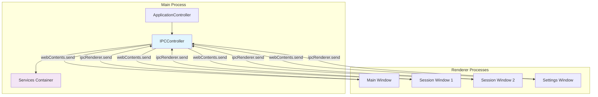
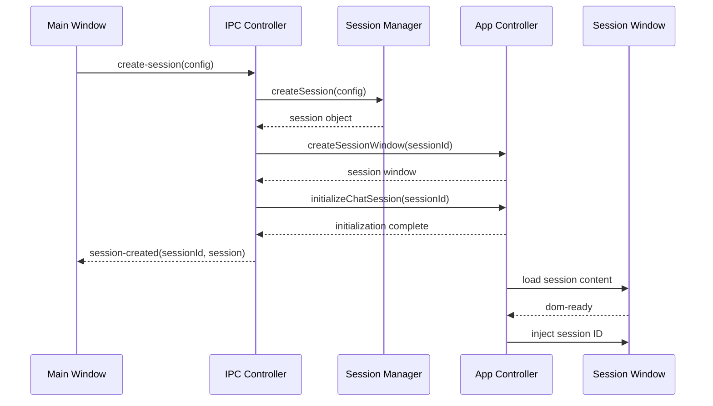
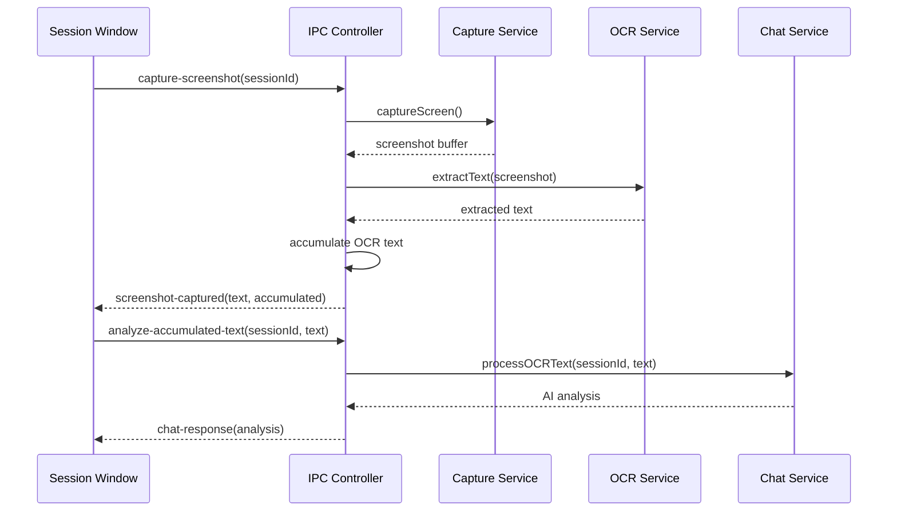
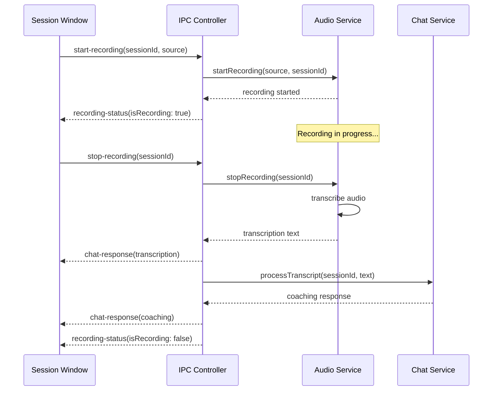

# GhostGuide IPC Communication Documentation

## Table of Contents

1. [IPC Architecture Overview](#ipc-architecture-overview)
2. [IPC Handler Categories](#ipc-handler-categories)
3. [Communication Patterns](#communication-patterns)
4. [Main Process IPC Handlers](#main-process-ipc-handlers)
5. [Renderer Process IPC Events](#renderer-process-ipc-events)
6. [IPC Message Flow Diagrams](#ipc-message-flow-diagrams)
7. [Error Handling in IPC](#error-handling-in-ipc)
8. [IPC Security Considerations](#ipc-security-considerations)
9. [Performance Optimization](#performance-optimization)
10. [Debugging IPC Communication](#debugging-ipc-communication)

---

## IPC Architecture Overview

The GhostGuide application uses Electron's Inter-Process Communication (IPC) system to enable communication between the main process (Node.js backend) and renderer processes (frontend windows). The `IPCController` class centralizes all IPC event handling and routing.

### IPC Communication Architecture



### IPC Event Categories

1. **Session Management**: Session creation, closure, state management
2. **Chat Communication**: Message exchange with AI
3. **Screenshot Operations**: Screen capture and OCR processing
4. **Audio Operations**: Recording and transcription
5. **RAG Operations**: Knowledge base management
6. **Configuration**: Settings and API key management
7. **Window Management**: Window control and coordination
8. **Error Handling**: Error reporting and recovery

---

## IPC Handler Categories

### Handler Organization

The `IPCController` organizes IPC handlers into logical groups:

```typescript
class IPCController {
    initialize(): void {
        this.setupSessionHandlers()      // Session lifecycle
        this.setupChatHandlers()        // AI chat communication
        this.setupScreenshotHandlers()  // Screenshot & OCR
        this.setupAudioHandlers()       // Audio recording
        this.setupRAGHandlers()         // Session-specific RAG
        this.setupGlobalRAGHandlers()   // Global RAG operations
        this.setupSettingsHandlers()    // Application settings
        this.setupAPIKeyHandlers()      // API key management
    }
}
```

### Handler Registration Pattern

```typescript
private setupSessionHandlers(): void {
    ipcMain.on('create-session', this.handleCreateSession.bind(this))
    ipcMain.on('close-session', this.handleCloseSession.bind(this))
    ipcMain.on('get-active-sessions', this.handleGetActiveSessions.bind(this))
}

private handleCreateSession(event: IpcMainEvent, config: SessionConfig): void {
    try {
        // Process request
        const result = await this.processCreateSession(config)
        // Send success response
        event.reply('session-created', result)
    } catch (error) {
        // Send error response
        event.reply('session-creation-error', error.message)
    }
}
```

---

## Communication Patterns

### 1. Request-Response Pattern

**Flow**: Renderer → Main → Renderer
**Usage**: Most IPC communications follow this pattern

```typescript
// Renderer Process
ipcRenderer.send('capture-screenshot', { sessionId })
ipcRenderer.once('screenshot-captured', (event, data) => {
    console.log('Screenshot result:', data)
})

// Main Process
ipcMain.on('capture-screenshot', async (event, data) => {
    try {
        const result = await this.processScreenshot(data.sessionId)
        event.reply('screenshot-captured', result)
    } catch (error) {
        event.reply('screenshot-error', error.message)
    }
})
```

### 2. Broadcast Pattern

**Flow**: Main → All Renderers
**Usage**: Global state changes, system notifications

```typescript
// Main Process - Broadcast to all windows
this.sessionWindows.forEach((window, sessionId) => {
    window.webContents.send('global-state-change', stateData)
})

// Renderer Process - Listen for broadcasts
ipcRenderer.on('global-state-change', (event, data) => {
    updateGlobalState(data)
})
```

### 3. Event Stream Pattern

**Flow**: Main → Specific Renderer (continuous)
**Usage**: Real-time updates, progress monitoring

```typescript
// Main Process - Stream events to specific window
const sessionWindow = this.sessionWindows.get(sessionId)
sessionWindow.webContents.send('recording-progress', {
    sessionId,
    duration: currentDuration,
    isActive: true
})

// Renderer Process - Handle streaming events
ipcRenderer.on('recording-progress', (event, data) => {
    updateRecordingUI(data.duration, data.isActive)
})
```

### 4. Acknowledgment Pattern

**Flow**: Renderer → Main → Acknowledgment
**Usage**: Critical operations requiring confirmation

```typescript
// Renderer Process
const result = await ipcRenderer.invoke('save-configuration', config)
if (result.success) {
    showSuccessMessage('Configuration saved')
} else {
    showErrorMessage(result.error)
}

// Main Process
ipcMain.handle('save-configuration', async (event, config) => {
    try {
        await this.configurationManager.saveConfiguration(config)
        return { success: true }
    } catch (error) {
        return { success: false, error: error.message }
    }
})
```

---

## Main Process IPC Handlers

### Session Management Handlers

#### 1. Session Creation

```typescript
Event: 'create-session'
Handler: handleCreateSession(event, config)
Response: 'session-created' | 'session-creation-error'

// Input Data
interface SessionConfig {
    profession: string
    interviewType: string
    context?: string
}

// Success Response
interface SessionCreatedResponse {
    sessionId: string
    session: Session
    timestamp: Date
}

// Flow
ipcMain.on('create-session', async (event, config) => {
    const sessionId = generateId()
    const session = await this.sessionManager.createSession(config)
    
    const sessionWindow = this.createSessionWindowCallback(sessionId, config)
    await this.initializeChatSessionWithContext(sessionId, config)
    
    event.reply('session-created', {
        sessionId,
        session,
        timestamp: new Date()
    })
})
```

#### 2. Session Closure

```typescript
Event: 'close-session'
Handler: handleCloseSession(event, sessionId)
Response: 'session-closed' | 'session-close-error'

// Flow
ipcMain.on('close-session', async (event, sessionId) => {
    // Stop any active recordings
    if (this.audioService.getRecordingStatus(sessionId).isRecording) {
        await this.audioService.stopRecording(sessionId)
    }
    
    // Close session
    await this.sessionManager.closeSession(sessionId)
    
    // Cleanup UI references
    this.sessionWindows.delete(sessionId)
    this.sessions.delete(sessionId)
    
    event.reply('session-closed', { sessionId })
})
```

### Chat Communication Handlers

#### 1. Regular Chat Messages

```typescript
Event: 'chat-message'
Handler: handleChatMessage(event, data)
Response: 'chat-response' | 'chat-error'

// Input Data
interface ChatMessageData {
    sessionId: string
    message: string
    source?: 'user' | 'audio-transcription'
}

// Response Data
interface ChatResponseData {
    sessionId: string
    content: string
    timestamp: Date
    source: 'ai-response' | 'fallback-response'
}

// Flow
ipcMain.on('chat-message', async (event, data) => {
    const { sessionId, message, source } = data
    const session = this.sessions.get(sessionId)
    
    if (this.chatService.isConfigured() && session) {
        const contextualMessage = source === 'audio-transcription' 
            ? `[Audio] ${message}` 
            : message
            
        const response = await this.chatService.sendMessage(sessionId, contextualMessage)
        
        event.reply('chat-response', {
            sessionId,
            content: response,
            timestamp: new Date(),
            source: 'ai-response'
        })
    } else {
        // Fallback response
        const fallbackResponse = this.generateFallbackResponse(message, session)
        event.reply('chat-response', {
            sessionId,
            content: fallbackResponse,
            timestamp: new Date(),
            source: 'fallback-response'
        })
    }
})
```

### Screenshot Handlers

#### 1. Single Screenshot Capture

```typescript
Event: 'capture-screenshot'
Handler: handleCaptureScreenshot(event, data)
Response: 'screenshot-captured' | 'screenshot-error'

// Flow
ipcMain.on('capture-screenshot', async (event, data) => {
    const { sessionId } = data
    const session = this.sessions.get(sessionId)
    
    // Capture screenshot
    const screenshot = await this.services.captureService.captureScreen()
    
    // Extract text via OCR
    const ocrText = await this.services.ocrService.extractText(screenshot)
    
    // Store accumulated OCR text
    if (!session.accumulatedOCR) session.accumulatedOCR = {}
    session.accumulatedOCR['screenshot'] = ocrText
    
    // Find session window
    const sessionWindow = this.sessionWindows.get(sessionId)
    
    // Send result to session window
    sessionWindow.webContents.send('screenshot-captured', {
        sessionId,
        text: ocrText,
        accumulatedText: ocrText,
        timestamp: new Date()
    })
})
```

#### 2. Multi-Step Screenshot Capture

```typescript
Event: 'multi-capture'
Handler: handleMultiCapture(event, data)
Response: 'screenshot-captured' | 'screenshot-error'

// Input Data
interface MultiCaptureData {
    sessionId: string
    actionType: string
    captureType: 'full' | 'left_half' | 'right_half'
    accumulatedText?: string
}

// Flow
ipcMain.on('multi-capture', async (event, data) => {
    const { sessionId, actionType, captureType, accumulatedText } = data
    
    // Map capture type to enum
    const captureTypeEnum = this.mapCaptureTypeToEnum(captureType)
    
    // Capture with specific type
    const screenshot = await this.services.captureService.captureScreenWithType(captureTypeEnum)
    
    // Extract text
    const newOcrText = await this.services.ocrService.extractText(screenshot)
    
    // Accumulate text
    const combinedText = accumulatedText 
        ? `${accumulatedText}\n\n--- Additional Capture ---\n\n${newOcrText}`
        : newOcrText
    
    // Update session
    const session = this.sessions.get(sessionId)
    session.accumulatedOCR[actionType] = combinedText
    
    event.reply('screenshot-captured', {
        sessionId,
        text: newOcrText,
        accumulatedText: combinedText,
        captureType,
        timestamp: new Date()
    })
})
```

#### 3. OCR Text Analysis

```typescript
Event: 'analyze-accumulated-text'
Handler: handleAnalyzeAccumulatedText(event, data)
Response: 'chat-response' | 'analysis-error'

// Flow
ipcMain.on('analyze-accumulated-text', async (event, data) => {
    const { sessionId, actionType, accumulatedText } = data
    const session = this.sessions.get(sessionId)
    
    let analysisResult: string
    
    if (this.chatService.isConfigured() && session) {
        // AI-powered analysis
        const action = actionType === 'screenshot' ? ActionType.SCREENSHOT : ActionType.DEBUG
        analysisResult = await this.chatService.processOCRText(sessionId, accumulatedText, action)
    } else {
        // Fallback analysis
        analysisResult = this.generateFallbackAnalysis(accumulatedText, session?.profession, session?.interviewType)
    }
    
    event.reply('chat-response', {
        sessionId,
        content: `📝 **Complete Analysis:**\n\n${analysisResult}`,
        metadata: { action: actionType, analysisType: 'accumulated' },
        timestamp: new Date()
    })
    
    // Cleanup accumulated text
    delete session.accumulatedOCR[actionType]
})
```

### Audio Handlers

#### 1. Start Recording

```typescript
Event: 'start-recording'
Handler: handleStartRecording(event, data)
Response: 'recording-status' | 'recording-error'

// Input Data
interface StartRecordingData {
    sessionId: string
    source: 'interviewer' | 'interviewee' | 'both' | 'system'
}

// Flow
ipcMain.on('start-recording', async (event, data) => {
    const { sessionId, source } = data
    const session = this.sessions.get(sessionId)
    
    if (!session) {
        event.reply('recording-error', 'Session not found')
        return
    }
    
    // Ensure audio service is ready
    if (!this.services.audioService.isReady()) {
        await this.services.audioService.initialize()
    }
    
    // Map source to enum
    const audioSource = this.mapSourceToAudioSource(source)
    
    // Start recording
    await this.services.audioService.startRecording(audioSource, sessionId)
    
    // Update session state
    session.isRecording = true
    session.recordingSource = audioSource
    
    event.reply('recording-status', {
        sessionId,
        isRecording: true,
        source
    })
})
```

#### 2. Stop Recording

```typescript
Event: 'stop-recording'
Handler: handleStopRecording(event, data)
Response: 'recording-status' + 'chat-response' | 'recording-error'

// Flow
ipcMain.on('stop-recording', async (event, data) => {
    const { sessionId } = data
    const session = this.sessions.get(sessionId)
    
    // Stop recording and get transcription
    const transcription = await this.services.audioService.stopRecording(sessionId)
    
    // Update session state
    const recordingSource = session.recordingSource
    session.isRecording = false
    session.recordingSource = null
    
    // Send transcription to session window
    const sessionWindow = this.sessionWindows.get(sessionId)
    sessionWindow.webContents.send('chat-response', {
        sessionId,
        content: `🎤 **Complete Transcription:** ${transcription}`,
        timestamp: new Date(),
        source: 'complete-audio-transcription'
    })
    
    // Process with AI if available
    if (this.chatService.isConfigured() && session) {
        const coachingResponse = await this.chatService.processTranscript(sessionId, transcription, recordingSource)
        
        sessionWindow.webContents.send('chat-response', {
            sessionId,
            content: `🤖 **AI Analysis:** ${coachingResponse}`,
            timestamp: new Date(),
            source: 'complete-audio-analysis'
        })
    }
    
    event.reply('recording-status', {
        sessionId,
        isRecording: false
    })
})
```

### RAG Handlers

#### 1. Session-Specific RAG

```typescript
Event: 'add-rag-material'
Handler: handleAddRAGMaterial(event, data)
Response: 'rag-success' | 'rag-error'

// Flow
ipcMain.on('add-rag-material', async (event, data) => {
    const { sessionId } = data
    
    // Show folder selection dialog
    const result = await dialog.showOpenDialog({
        title: 'Select Study Materials Folder',
        properties: ['openDirectory']
    })
    
    if (result.canceled) return
    
    const folderPath = result.filePaths[0]
    
    // Ingest documents
    const ingestionResult = await this.services.ragService.ingestDocuments(folderPath, sessionId)
    
    // Update session RAG status
    const session = this.sessions.get(sessionId)
    session.hasRAG = true
    
    event.reply('rag-success', {
        sessionId,
        documentsProcessed: ingestionResult.documentsProcessed,
        folderPath,
        timestamp: new Date()
    })
})
```

#### 2. Global RAG Operations

```typescript
Event: 'add-global-rag-document'
Handler: handleAddGlobalRAGDocument(event, data)
Response: 'global-rag-success' | 'global-rag-error'

// Input Data
interface GlobalRAGData {
    content: string
    metadata: {
        title: string
        type: 'resume' | 'experience' | 'project'
        profession: string
        tags: string[]
    }
}

// Flow
ipcMain.on('add-global-rag-document', async (event, data) => {
    const { content, metadata } = data
    
    await this.services.globalRagService.addDocument(content, metadata)
    
    event.reply('global-rag-success', {
        message: 'Document added to global knowledge base',
        metadata,
        timestamp: new Date()
    })
})
```

### Configuration Handlers

#### 1. API Key Management

```typescript
Event: 'save-api-key'
Handler: handleSaveApiKey(event, apiKey)
Response: 'api-key-saved' | 'api-key-error'

// Flow
ipcMain.on('save-api-key', async (event, apiKey) => {
    try {
        await this.services.configurationManager.updateApiKey(apiKey)
        event.reply('api-key-saved')
    } catch (error) {
        event.reply('api-key-error', error.message)
    }
})

Event: 'test-api-key'
Handler: handleTestApiKey(event, apiKey)
Response: 'api-key-valid' | 'api-key-invalid'

// Flow
ipcMain.on('test-api-key', async (event, apiKey) => {
    try {
        const testClient = new OpenAI({ apiKey })
        await testClient.models.list()
        event.reply('api-key-valid', 'API key is valid!')
    } catch (error) {
        event.reply('api-key-invalid', error.message)
    }
})
```

---

## Renderer Process IPC Events

### Main Window IPC Events

```typescript
// Session Management
ipcRenderer.send('create-session', sessionConfig)
ipcRenderer.on('session-created', handleSessionCreated)
ipcRenderer.on('session-creation-error', handleSessionError)

// Settings
ipcRenderer.send('save-api-key', apiKey)
ipcRenderer.on('api-key-saved', handleApiKeySaved)
ipcRenderer.send('test-api-key', apiKey)
ipcRenderer.on('api-key-valid', handleApiKeyValid)
ipcRenderer.on('api-key-invalid', handleApiKeyInvalid)

// Global RAG
ipcRenderer.send('add-global-rag-document', ragData)
ipcRenderer.on('global-rag-success', handleGlobalRAGSuccess)
```

### Session Window IPC Events

```typescript
// Chat Communication
ipcRenderer.send('chat-message', { sessionId, message })
ipcRenderer.on('chat-response', handleChatResponse)

// Screenshot Operations
ipcRenderer.send('capture-screenshot', { sessionId })
ipcRenderer.send('multi-capture', multiCaptureData)
ipcRenderer.on('screenshot-captured', handleScreenshotCaptured)
ipcRenderer.send('analyze-accumulated-text', analysisData)

// Audio Operations
ipcRenderer.send('start-recording', { sessionId, source })
ipcRenderer.send('stop-recording', { sessionId })
ipcRenderer.on('recording-status', handleRecordingStatus)

// RAG Operations
ipcRenderer.send('add-rag-material', { sessionId })
ipcRenderer.on('rag-success', handleRAGSuccess)
ipcRenderer.on('rag-error', handleRAGError)

// Session Lifecycle
ipcRenderer.send('close-session', sessionId)
ipcRenderer.on('session-closed', handleSessionClosed)
```

---

## IPC Message Flow Diagrams

### Session Creation Flow



### Screenshot Analysis Flow



### Audio Recording Flow



---

## Error Handling in IPC

### Error Response Pattern

All IPC handlers follow a consistent error handling pattern:

```typescript
ipcMain.on('event-name', async (event, data) => {
    try {
        // Process the request
        const result = await processRequest(data)
        
        // Send success response
        event.reply('event-success', result)
    } catch (error) {
        // Log error
        logger.error('IPC handler failed', {
            event: 'event-name',
            error: error.message,
            data
        })
        
        // Send error response
        event.reply('event-error', {
            message: error.message,
            code: error.code || 'UNKNOWN_ERROR',
            timestamp: new Date()
        })
    }
})
```

### Error Categories and Handling

```typescript
// Service Not Ready Error
catch (ServiceNotReadyError) {
    event.reply('service-error', {
        type: 'SERVICE_NOT_READY',
        message: 'Service is initializing, please try again',
        canRetry: true
    })
}

// Configuration Error
catch (ConfigurationError) {
    event.reply('configuration-error', {
        type: 'CONFIGURATION_REQUIRED',
        message: 'Please configure API key in settings',
        action: 'OPEN_SETTINGS'
    })
}

// External Dependency Error
catch (ExternalDependencyError) {
    event.reply('dependency-error', {
        type: 'EXTERNAL_TOOL_MISSING',
        message: `${error.tool} is not available`,
        fallbackAvailable: error.hasFallback
    })
}
```

### Client-Side Error Handling

```typescript
// Renderer Process Error Handling
function setupErrorHandlers() {
    // Service errors
    ipcRenderer.on('service-error', (event, error) => {
        if (error.canRetry) {
            showRetryDialog(error.message)
        } else {
            showErrorNotification(error.message)
        }
    })
    
    // Configuration errors
    ipcRenderer.on('configuration-error', (event, error) => {
        if (error.action === 'OPEN_SETTINGS') {
            showConfigurationPrompt(error.message)
        }
    })
    
    // Timeout errors
    setupIPCTimeouts()
}

function setupIPCTimeouts() {
    const TIMEOUT_MS = 30000
    
    function sendWithTimeout(event, data) {
        return new Promise((resolve, reject) => {
            const timeoutId = setTimeout(() => {
                reject(new Error('IPC request timed out'))
            }, TIMEOUT_MS)
            
            ipcRenderer.once(`${event}-success`, (event, result) => {
                clearTimeout(timeoutId)
                resolve(result)
            })
            
            ipcRenderer.once(`${event}-error`, (event, error) => {
                clearTimeout(timeoutId)
                reject(new Error(error.message))
            })
            
            ipcRenderer.send(event, data)
        })
    }
}
```

---

## IPC Security Considerations

### Context Isolation

```typescript
// Main Process - Preload Script Setup
const preloadPath = path.join(__dirname, 'preload.js')

new BrowserWindow({
    webPreferences: {
        nodeIntegration: false,
        contextIsolation: true,
        preload: preloadPath
    }
})

// Preload Script - Controlled IPC Access
const { contextBridge, ipcRenderer } = require('electron')

contextBridge.exposeInMainWorld('electronAPI', {
    // Session operations
    createSession: (config) => ipcRenderer.send('create-session', config),
    closeSession: (sessionId) => ipcRenderer.send('close-session', sessionId),
    
    // Chat operations
    sendMessage: (data) => ipcRenderer.send('chat-message', data),
    onChatResponse: (callback) => ipcRenderer.on('chat-response', callback),
    
    // Screenshot operations
    captureScreenshot: (data) => ipcRenderer.send('capture-screenshot', data),
    onScreenshotCaptured: (callback) => ipcRenderer.on('screenshot-captured', callback),
    
    // Audio operations
    startRecording: (data) => ipcRenderer.send('start-recording', data),
    stopRecording: (data) => ipcRenderer.send('stop-recording', data),
    onRecordingStatus: (callback) => ipcRenderer.on('recording-status', callback)
})
```

### Input Validation

```typescript
// Main Process - Input Validation
class IPCValidator {
    static validateSessionConfig(config: any): SessionConfig {
        if (!config || typeof config !== 'object') {
            throw new ValidationError('Invalid session configuration')
        }
        
        if (!config.profession || typeof config.profession !== 'string') {
            throw new ValidationError('Profession is required')
        }
        
        if (!config.interviewType || typeof config.interviewType !== 'string') {
            throw new ValidationError('Interview type is required')
        }
        
        return {
            profession: config.profession,
            interviewType: config.interviewType,
            context: config.context || undefined
        }
    }
    
    static validateSessionId(sessionId: any): string {
        if (!sessionId || typeof sessionId !== 'string') {
            throw new ValidationError('Invalid session ID')
        }
        
        if (!uuidv4Regex.test(sessionId)) {
            throw new ValidationError('Session ID must be valid UUID')
        }
        
        return sessionId
    }
}

// Usage in IPC handlers
ipcMain.on('create-session', async (event, rawConfig) => {
    try {
        const config = IPCValidator.validateSessionConfig(rawConfig)
        // Process validated config...
    } catch (error) {
        event.reply('session-creation-error', error.message)
    }
})
```

### Rate Limiting

```typescript
class IPCRateLimiter {
    private requestCounts = new Map<string, number>()
    private windowTimestamps = new Map<string, number>()
    
    private readonly WINDOW_SIZE = 60000 // 1 minute
    private readonly MAX_REQUESTS_PER_WINDOW = 100
    
    checkRateLimit(event: string, senderId: number): boolean {
        const key = `${senderId}-${event}`
        const now = Date.now()
        const windowStart = this.windowTimestamps.get(key) || now
        
        if (now - windowStart > this.WINDOW_SIZE) {
            // Reset window
            this.windowTimestamps.set(key, now)
            this.requestCounts.set(key, 1)
            return true
        }
        
        const currentCount = this.requestCounts.get(key) || 0
        if (currentCount >= this.MAX_REQUESTS_PER_WINDOW) {
            return false // Rate limit exceeded
        }
        
        this.requestCounts.set(key, currentCount + 1)
        return true
    }
}

// Usage in IPC handlers
const rateLimiter = new IPCRateLimiter()

ipcMain.on('chat-message', async (event, data) => {
    if (!rateLimiter.checkRateLimit('chat-message', event.sender.id)) {
        event.reply('rate-limit-error', 'Too many requests')
        return
    }
    
    // Process request...
})
```

---

## Performance Optimization

### Message Batching

```typescript
class IPCBatchProcessor {
    private batches = new Map<string, any[]>()
    private timers = new Map<string, NodeJS.Timeout>()
    
    private readonly BATCH_SIZE = 10
    private readonly BATCH_TIMEOUT = 100 // ms
    
    addToBatch(event: string, data: any, callback: Function): void {
        if (!this.batches.has(event)) {
            this.batches.set(event, [])
        }
        
        const batch = this.batches.get(event)!
        batch.push({ data, callback })
        
        if (batch.length >= this.BATCH_SIZE) {
            this.processBatch(event)
        } else if (!this.timers.has(event)) {
            const timer = setTimeout(() => {
                this.processBatch(event)
            }, this.BATCH_TIMEOUT)
            this.timers.set(event, timer)
        }
    }
    
    private processBatch(event: string): void {
        const batch = this.batches.get(event)
        if (!batch || batch.length === 0) return
        
        // Clear batch and timer
        this.batches.set(event, [])
        const timer = this.timers.get(event)
        if (timer) {
            clearTimeout(timer)
            this.timers.delete(event)
        }
        
        // Process batch
        this.processBatchItems(event, batch)
    }
}
```

### Response Caching

```typescript
class IPCResponseCache {
    private cache = new Map<string, any>()
    private timestamps = new Map<string, number>()
    
    private readonly CACHE_TTL = 5000 // 5 seconds
    
    getCachedResponse(key: string): any | null {
        const timestamp = this.timestamps.get(key)
        if (!timestamp || Date.now() - timestamp > this.CACHE_TTL) {
            this.cache.delete(key)
            this.timestamps.delete(key)
            return null
        }
        
        return this.cache.get(key) || null
    }
    
    setCachedResponse(key: string, response: any): void {
        this.cache.set(key, response)
        this.timestamps.set(key, Date.now())
    }
    
    generateCacheKey(event: string, data: any): string {
        return `${event}-${JSON.stringify(data)}`
    }
}

// Usage
const responseCache = new IPCResponseCache()

ipcMain.on('get-session-data', async (event, sessionId) => {
    const cacheKey = responseCache.generateCacheKey('get-session-data', sessionId)
    const cached = responseCache.getCachedResponse(cacheKey)
    
    if (cached) {
        event.reply('session-data', cached)
        return
    }
    
    const sessionData = await this.sessionManager.getSession(sessionId)
    responseCache.setCachedResponse(cacheKey, sessionData)
    event.reply('session-data', sessionData)
})
```

---

## Debugging IPC Communication

### IPC Event Logging

```typescript
class IPCLogger {
    private logLevel: 'debug' | 'info' | 'warn' | 'error' = 'info'
    
    logIPCEvent(direction: 'send' | 'receive', event: string, data?: any): void {
        if (this.logLevel !== 'debug') return
        
        const timestamp = new Date().toISOString()
        const logData = {
            timestamp,
            direction,
            event,
            dataSize: data ? JSON.stringify(data).length : 0,
            data: this.logLevel === 'debug' ? data : undefined
        }
        
        console.log(`[IPC ${direction.toUpperCase()}]`, logData)
    }
    
    logIPCError(event: string, error: Error, data?: any): void {
        console.error(`[IPC ERROR] Event: ${event}`, {
            error: error.message,
            stack: error.stack,
            data
        })
    }
}

// Integration with IPC handlers
const ipcLogger = new IPCLogger()

ipcMain.on('chat-message', async (event, data) => {
    ipcLogger.logIPCEvent('receive', 'chat-message', data)
    
    try {
        const result = await this.processChatMessage(data)
        ipcLogger.logIPCEvent('send', 'chat-response', result)
        event.reply('chat-response', result)
    } catch (error) {
        ipcLogger.logIPCError('chat-message', error, data)
        event.reply('chat-error', error.message)
    }
})
```

### IPC Performance Monitoring

```typescript
class IPCPerformanceMonitor {
    private metrics = new Map<string, {
        count: number
        totalTime: number
        avgTime: number
        maxTime: number
        minTime: number
    }>()
    
    startTimer(event: string): string {
        const timerId = `${event}-${Date.now()}-${Math.random()}`
        performance.mark(`ipc-start-${timerId}`)
        return timerId
    }
    
    endTimer(timerId: string, event: string): void {
        performance.mark(`ipc-end-${timerId}`)
        performance.measure(`ipc-${timerId}`, `ipc-start-${timerId}`, `ipc-end-${timerId}`)
        
        const measure = performance.getEntriesByName(`ipc-${timerId}`)[0]
        const duration = measure.duration
        
        this.updateMetrics(event, duration)
        
        // Cleanup
        performance.clearMarks(`ipc-start-${timerId}`)
        performance.clearMarks(`ipc-end-${timerId}`)
        performance.clearMeasures(`ipc-${timerId}`)
    }
    
    private updateMetrics(event: string, duration: number): void {
        if (!this.metrics.has(event)) {
            this.metrics.set(event, {
                count: 0,
                totalTime: 0,
                avgTime: 0,
                maxTime: 0,
                minTime: Infinity
            })
        }
        
        const metrics = this.metrics.get(event)!
        metrics.count++
        metrics.totalTime += duration
        metrics.avgTime = metrics.totalTime / metrics.count
        metrics.maxTime = Math.max(metrics.maxTime, duration)
        metrics.minTime = Math.min(metrics.minTime, duration)
    }
    
    getMetrics(): Map<string, any> {
        return new Map(this.metrics)
    }
}
```

---

This comprehensive IPC communication documentation covers all aspects of inter-process communication in GhostGuide, from basic patterns to advanced optimization and debugging techniques.
