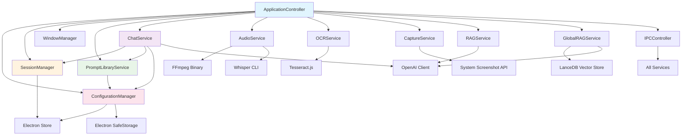

# GhostGuide Service Architecture Documentation

## Table of Contents

1. [Service Layer Overview](#service-layer-overview)
2. [Service Dependencies Graph](#service-dependencies-graph)
3. [Core Services](#core-services)
4. [Service Initialization](#service-initialization)
5. [Service Communication Patterns](#service-communication-patterns)
6. [Service Lifecycle Management](#service-lifecycle-management)
7. [Inter-Service Data Flow](#inter-service-data-flow)
8. [Service Configuration](#service-configuration)
9. [Error Handling and Recovery](#error-handling-and-recovery)
10. [Performance and Optimization](#performance-and-optimization)

---

## Service Layer Overview

The GhostGuide application follows a service-oriented architecture where each service handles specific business logic domains. All services are managed by the `ApplicationController` and communicate through well-defined interfaces.

### Service Architecture Principles

- **Single Responsibility**: Each service handles one specific domain
- **Dependency Injection**: Services receive dependencies through constructor injection
- **Loose Coupling**: Services communicate through interfaces, not direct implementations
- **Async/Await**: All service operations are asynchronous for non-blocking execution
- **Error Isolation**: Service failures are contained and don't cascade
- **Resource Management**: Services manage their own resources and cleanup

---

## Service Dependencies Graph



---

## Core Services

### 1. ApplicationController
**Purpose**: Central orchestrator and service container
**Dependencies**: All other services
**Lifecycle**: Application lifetime
**Key Responsibilities**:
- Service initialization and management
- Application lifecycle events
- Global configuration
- Window management coordination
- IPC setup and coordination

```typescript
class ApplicationController {
    private services: ServiceContainer
    private config: ApplicationConfig
    private store: Store
    private openai: OpenAI | null
    private ipcController: IPCController
    
    constructor(config: ApplicationConfig)
    async initialize(): Promise<void>
    async shutdown(): Promise<void>
    createMainWindow(): BrowserWindow
    createSessionWindow(sessionId: string, config: SessionConfig): BrowserWindow
}
```

### 2. ConfigurationManager
**Purpose**: Manages application configuration and settings
**Dependencies**: Electron Store, SafeStorage
**Lifecycle**: Application lifetime
**Key Responsibilities**:
- Configuration loading/saving
- API key management (encrypted storage)
- Settings validation
- Configuration migrations

```typescript
class ConfigurationManager {
    private config: ApplicationConfig
    private store: Store
    
    async initialize(): Promise<void>
    async updateApiKey(apiKey: string): Promise<void>
    async loadConfiguration(): Promise<ApplicationConfig>
    async saveConfiguration(config: ApplicationConfig): Promise<void>
    isApiKeyConfigured(): boolean
    getApiKey(): string | null
}
```

### 3. SessionManager
**Purpose**: Manages interview session lifecycle and state
**Dependencies**: Store (for persistence)
**Lifecycle**: Application lifetime
**Key Responsibilities**:
- Session creation/destruction
- Session state management
- Session persistence
- Session validation

```typescript
class SessionManager {
    private sessions: Map<string, Session>
    private store: Store
    
    async createSession(config: SessionConfig): Promise<Session>
    async closeSession(sessionId: string): Promise<void>
    getSession(sessionId: string): Session | null
    getAllSessions(): Session[]
    async persistSession(session: Session): Promise<void>
}
```

### 4. ChatService
**Purpose**: Handles AI conversation and OpenAI integration
**Dependencies**: SessionManager, PromptLibraryService, ConfigurationManager, OpenAI
**Lifecycle**: Application lifetime
**Key Responsibilities**:
- OpenAI API communication
- Conversation history management
- Message processing and formatting
- Token usage tracking

```typescript
class ChatService {
    private openai: OpenAI | null
    private sessionManager: SessionManager
    private promptLibraryService: PromptLibraryService
    private conversationHistories: Map<string, ConversationMessage[]>
    
    constructor(deps: ChatServiceDependencies)
    async sendMessage(sessionId: string, message: string, isInitialization?: boolean): Promise<string>
    async processOCRText(sessionId: string, text: string, action: ActionType): Promise<string>
    async processTranscript(sessionId: string, transcript: string, source: AudioSource): Promise<string>
    isConfigured(): boolean
}
```

### 5. PromptLibraryService
**Purpose**: Manages AI prompts and personas
**Dependencies**: ConfigurationManager
**Lifecycle**: Application lifetime
**Key Responsibilities**:
- Prompt template management
- Persona customization
- Context-specific prompt generation
- Fallback prompt handling

```typescript
class PromptLibraryService {
    private configurationManager: ConfigurationManager
    private personas: Map<string, PersonaConfig>
    
    setConfigurationManager(configManager: ConfigurationManager): void
    async addPersona(personaName: string): Promise<void>
    getSystemPrompt(profession: string, interviewType: string): string
    getActionPrompt(action: ActionType, profession: string, interviewType: string): string
    getAudioCoachingPrompt(source: AudioSource, profession: string, interviewType: string): string
    getFallbackAnalysisPrompt(text: string, profession: string, interviewType: string): string
}
```

### 6. AudioService
**Purpose**: Handles audio recording and transcription
**Dependencies**: FFmpeg, Whisper CLI
**Lifecycle**: Application lifetime
**Key Responsibilities**:
- Audio device detection
- Recording management
- Audio processing (FFmpeg)
- Speech-to-text transcription (Whisper)

```typescript
class AudioService {
    private isInitialized: boolean
    private recordingSessions: Map<string, RecordingSession>
    private accumulatedTranscriptions: Map<string, string>
    
    async initialize(): Promise<void>
    async startRecording(source: AudioSource, sessionId: string): Promise<void>
    async stopRecording(sessionId: string): Promise<string | null>
    getRecordingStatus(sessionId: string): RecordingStatus
    isReady(): boolean
}
```

### 7. OCRService
**Purpose**: Optical Character Recognition from screenshots
**Dependencies**: Tesseract.js
**Lifecycle**: Application lifetime
**Key Responsibilities**:
- Tesseract worker management
- Image preprocessing
- Text extraction
- OCR result post-processing

```typescript
class OCRService {
    private worker: Tesseract.Worker | null
    
    async initialize(): Promise<void>
    async extractText(imageBuffer: Buffer): Promise<string>
    isReady(): boolean
}
```

### 8. CaptureService
**Purpose**: Screenshot capture functionality
**Dependencies**: System screenshot APIs
**Lifecycle**: Application lifetime
**Key Responsibilities**:
- Platform-specific screenshot capture
- Image processing and cropping
- Multiple capture modes (full, left, right)

```typescript
class CaptureService {
    async captureScreen(): Promise<Buffer>
    async captureScreenWithType(captureType: CaptureType): Promise<Buffer>
}
```

### 9. RAGService (Session-Specific)
**Purpose**: Session-specific RAG knowledge base
**Dependencies**: OpenAI (for embeddings)
**Lifecycle**: Per session
**Key Responsibilities**:
- Document ingestion per session
- Local knowledge base management
- Session-specific context retrieval

```typescript
class RAGService {
    private knowledgeBases: Map<string, KnowledgeBase>
    
    async ingestDocuments(folderPath: string, sessionId: string): Promise<IngestionResult>
    async searchRelevantContext(sessionId: string, query: string): Promise<SearchResult[]>
}
```

### 10. GlobalRAGService
**Purpose**: Global knowledge base for all sessions
**Dependencies**: LanceDB, OpenAI
**Lifecycle**: Application lifetime
**Key Responsibilities**:
- Global vector database management
- Cross-session knowledge sharing
- Resume/background data storage and retrieval

```typescript
class GlobalRAGService {
    private vectorDB: LanceDB
    private isReady: boolean
    
    async initialize(): Promise<void>
    async searchRelevantContext(query: string, limit: number): Promise<SearchResult[]>
    async addDocument(content: string, metadata: DocumentMetadata): Promise<void>
}
```

### 11. WindowManager
**Purpose**: Manages application windows
**Dependencies**: None (direct Electron API usage)
**Lifecycle**: Application lifetime
**Key Responsibilities**:
- Window creation and configuration
- Window state management
- Stealth mode window settings

```typescript
class WindowManager {
    private windows: Map<string, BrowserWindow>
    
    createWindow(config: WindowConfig): BrowserWindow
    getWindow(id: string): BrowserWindow | null
    closeWindow(id: string): void
    applyStealthSettings(window: BrowserWindow): void
}
```

### 12. IPCController
**Purpose**: Inter-Process Communication coordination
**Dependencies**: All services
**Lifecycle**: Application lifetime
**Key Responsibilities**:
- IPC event handler setup
- Request routing to services
- Response formatting and error handling

```typescript
class IPCController {
    private services: ServiceContainer
    private sessionWindows: Map<string, BrowserWindow>
    private sessions: Map<string, Session>
    
    constructor(services: ServiceContainer, windows: WindowMap, sessions: SessionMap, callback: WindowCallback)
    initialize(): void
    private setupSessionHandlers(): void
    private setupChatHandlers(): void
    private setupScreenshotHandlers(): void
    private setupAudioHandlers(): void
    // ... other handler setup methods
}
```

---

## Service Initialization

### Initialization Sequence

Services are initialized in a specific order to respect dependencies:

```typescript
// 1. Core Configuration Services
async initializeServices() {
    // Basic services with no dependencies
    this.services = {
        configurationManager: new ConfigurationManager(),
        sessionManager: new SessionManager(),
        windowManager: new WindowManager(),
    }
    
    // Services with external dependencies
    this.services.ocrService = new OCRService()
    this.services.captureService = new CaptureService()
    this.services.audioService = new AudioService()
    this.services.ragService = new RAGService()
    this.services.globalRagService = new GlobalRAGService()
    
    // Services with internal dependencies
    this.services.promptLibraryService = new PromptLibraryService()
    this.services.promptLibraryService.setConfigurationManager(this.services.configurationManager)
    
    // Services requiring full dependency injection
    this.services.chatService = new ChatService({
        sessionManager: this.services.sessionManager,
        promptLibraryService: this.services.promptLibraryService,
        configurationManager: this.services.configurationManager,
        openai: this.openai
    })
}

// 2. Async Initialization
async initializeServicesAsync() {
    await this.services.configurationManager.initialize()
    await this.services.promptLibraryService.addPersona('quantitative-finance-engineer')
    await this.services.audioService.initialize()
    await this.services.ocrService.initialize()
    await this.services.globalRagService.initialize()
}
```

### Service Dependencies Resolution

```typescript
interface ServiceDependencies {
    // Required dependencies
    sessionManager: SessionManager
    promptLibraryService: PromptLibraryService
    configurationManager: ConfigurationManager
    
    // Optional dependencies
    openai?: OpenAI | null
}

interface ServiceContainer {
    configurationManager: ConfigurationManager
    sessionManager: SessionManager
    windowManager: WindowManager
    promptLibraryService: PromptLibraryService
    chatService: ChatService
    audioService: AudioService
    ocrService: OCRService
    captureService: CaptureService
    ragService: RAGService
    globalRagService: GlobalRAGService
}
```

---

## Service Communication Patterns

### 1. Direct Method Calls
Used for synchronous operations within the same process:

```typescript
// ConfigurationManager -> PromptLibraryService
const apiKey = this.configurationManager.getApiKey()

// ChatService -> SessionManager
const session = this.sessionManager.getSession(sessionId)
```

### 2. Event-Driven Communication
Used for loose coupling between services:

```typescript
// Service emits events
class AudioService extends EventEmitter {
    async stopRecording(sessionId: string) {
        const transcript = await this.transcribe()
        this.emit('transcription-complete', { sessionId, transcript })
    }
}

// Other services listen
this.audioService.on('transcription-complete', (data) => {
    this.chatService.processTranscript(data.sessionId, data.transcript)
})
```

### 3. Callback Pattern
Used for service coordination:

```typescript
// ApplicationController provides callbacks to services
const sessionWindowCallback = (sessionId: string, config: SessionConfig) => {
    return this.createSessionWindow(sessionId, config)
}

// IPCController uses callback
this.ipcController = new IPCController(
    this.getServices(),
    this.sessionWindows,
    this.sessions,
    sessionWindowCallback
)
```

### 4. Dependency Injection
Used for service composition:

```typescript
// Services receive dependencies through constructor
class ChatService {
    constructor(private deps: {
        sessionManager: SessionManager
        promptLibraryService: PromptLibraryService
        configurationManager: ConfigurationManager
        openai: OpenAI | null
    }) {}
}
```

---

## Service Lifecycle Management

### Service States

Each service goes through these lifecycle states:

1. **Uninitialized**: Service created but not ready
2. **Initializing**: Service running initialization code
3. **Ready**: Service ready to handle requests
4. **Error**: Service encountered initialization error
5. **Shutting Down**: Service cleaning up resources
6. **Destroyed**: Service fully cleaned up

```typescript
enum ServiceState {
    UNINITIALIZED = 'uninitialized',
    INITIALIZING = 'initializing',
    READY = 'ready',
    ERROR = 'error',
    SHUTTING_DOWN = 'shutting_down',
    DESTROYED = 'destroyed'
}

abstract class BaseService {
    protected state: ServiceState = ServiceState.UNINITIALIZED
    
    abstract async initialize(): Promise<void>
    abstract async shutdown(): Promise<void>
    
    isReady(): boolean {
        return this.state === ServiceState.READY
    }
    
    protected setState(state: ServiceState) {
        this.state = state
        this.emit('state-change', { service: this.constructor.name, state })
    }
}
```

### Initialization Patterns

#### Synchronous Services
Services that can be used immediately:

```typescript
class SessionManager {
    constructor() {
        this.sessions = new Map()
        this.store = new Store()
        // Ready immediately
    }
}
```

#### Asynchronous Services
Services requiring async initialization:

```typescript
class OCRService {
    private worker: Tesseract.Worker | null = null
    
    async initialize(): Promise<void> {
        this.worker = await Tesseract.createWorker()
        await this.worker.loadLanguage('eng')
        await this.worker.initialize('eng')
    }
    
    isReady(): boolean {
        return this.worker !== null
    }
}
```

#### External Dependency Services
Services depending on external tools:

```typescript
class AudioService {
    private isInitialized = false
    
    async initialize(): Promise<void> {
        await this.checkFFmpegAvailability()
        await this.checkWhisperAvailability()
        await this.detectAudioDevices()
        this.isInitialized = true
    }
    
    private async checkFFmpegAvailability(): Promise<void> {
        try {
            await execAsync('ffmpeg -version')
        } catch (error) {
            throw new Error('FFmpeg not available')
        }
    }
}
```

### Cleanup and Shutdown

```typescript
class ApplicationController {
    async shutdown(): Promise<void> {
        // Stop active operations first
        await this.stopAllRecordings()
        await this.closeAllSessions()
        
        // Shutdown services in reverse dependency order
        await this.services.chatService.shutdown()
        await this.services.audioService.shutdown()
        await this.services.ocrService.shutdown()
        await this.services.globalRagService.shutdown()
        await this.services.configurationManager.shutdown()
        
        // Final cleanup
        this.sessionWindows.clear()
        this.sessions.clear()
    }
}
```

---

## Inter-Service Data Flow

### Data Flow Patterns

#### 1. Request-Response Pattern
Synchronous data request between services:

```
SessionManager.getSession(id) -> Session
ConfigurationManager.getApiKey() -> string | null
```

#### 2. Pipeline Pattern
Data flows through multiple services:

```
CaptureService -> OCRService -> ChatService -> Session Window
Screenshot -> Text -> Analysis -> Display
```

#### 3. Fan-out Pattern
One service triggering multiple others:

```
AudioService.stopRecording()
├── ChatService.processTranscript()
├── SessionManager.updateSession()
└── IPCController.sendResponse()
```

#### 4. Aggregation Pattern
Multiple services contributing to one result:

```
Session Creation:
├── SessionManager.createSession()
├── GlobalRAGService.searchRelevantContext()
├── PromptLibraryService.getSystemPrompt()
└── ChatService.initializeConversation()
```

### Data Types and Interfaces

#### Core Data Types

```typescript
// Session data
interface Session {
    id: string
    profession: string
    interviewType: string
    context?: string
    createdAt: Date
    isActive: boolean
    chatHistory: ConversationMessage[]
    isRecording: boolean
    hasRAG: boolean
    accumulatedOCR?: Record<string, string>
    recordingSource?: AudioSource
}

// Configuration data
interface ApplicationConfig {
    stealthMode: boolean
    debug: boolean
    logLevel: string
    apiKey?: string
    audioDevices?: AudioDeviceConfig[]
    ocrLanguage: string
}

// Service communication data
interface ServiceRequest {
    sessionId: string
    action: string
    data: any
    timestamp: Date
}

interface ServiceResponse {
    success: boolean
    data?: any
    error?: string
    timestamp: Date
}
```

#### Service-Specific Data

```typescript
// Chat Service
interface ConversationMessage {
    role: 'system' | 'user' | 'assistant'
    content: string
    timestamp: Date
}

// Audio Service
interface RecordingSession {
    process: ChildProcess
    outputFile: string
    source: AudioSource
    startTime: Date
}

// RAG Service
interface SearchResult {
    id: string
    text: string
    score: number
    metadata: DocumentMetadata
}

// OCR Service
interface OCRResult {
    text: string
    confidence: number
    boundingBoxes: BoundingBox[]
}
```

---

## Service Configuration

### Configuration Hierarchy

1. **Default Configuration**: Built-in defaults
2. **File Configuration**: Loaded from config.json
3. **Environment Variables**: Override file config
4. **Runtime Configuration**: Dynamic updates

```typescript
class ConfigurationManager {
    private defaultConfig: ApplicationConfig = {
        stealthMode: true,
        debug: false,
        logLevel: 'info',
        ocrLanguage: 'eng'
    }
    
    async loadConfiguration(): Promise<ApplicationConfig> {
        const fileConfig = await this.loadFromFile()
        const envConfig = this.loadFromEnvironment()
        
        return {
            ...this.defaultConfig,
            ...fileConfig,
            ...envConfig
        }
    }
}
```

### Service-Specific Configuration

```typescript
// Audio Service Configuration
interface AudioServiceConfig {
    ffmpegPath?: string
    whisperPath?: string
    defaultMicrophone?: string
    defaultSystemAudio?: string
    recordingQuality: 'low' | 'medium' | 'high'
    maxRecordingDuration: number
}

// OCR Service Configuration
interface OCRServiceConfig {
    language: string
    engineMode: number
    pageSegmentationMode: number
    preprocessingEnabled: boolean
}

// Chat Service Configuration
interface ChatServiceConfig {
    model: string
    maxTokens: number
    temperature: number
    maxHistoryLength: number
    fallbackEnabled: boolean
}
```

### Configuration Validation

```typescript
class ConfigurationValidator {
    static validateApplicationConfig(config: ApplicationConfig): ValidationResult {
        const errors: string[] = []
        
        if (config.apiKey && !this.isValidApiKey(config.apiKey)) {
            errors.push('Invalid API key format')
        }
        
        if (!['debug', 'info', 'warn', 'error'].includes(config.logLevel)) {
            errors.push('Invalid log level')
        }
        
        return {
            isValid: errors.length === 0,
            errors
        }
    }
    
    private static isValidApiKey(apiKey: string): boolean {
        return apiKey.startsWith('sk-') && apiKey.length >= 32
    }
}
```

---

## Error Handling and Recovery

### Error Categories

1. **Initialization Errors**: Service fails to start
2. **Runtime Errors**: Service encounters error during operation
3. **External Dependency Errors**: External tool/API failures
4. **Configuration Errors**: Invalid configuration
5. **Resource Errors**: Memory, disk, network issues

### Error Handling Strategies

#### Service-Level Error Handling

```typescript
class BaseService {
    protected async handleError(error: Error, context: string): Promise<void> {
        this.logger.error(`Service error in ${context}`, {
            error: error.message,
            stack: error.stack,
            service: this.constructor.name
        })
        
        // Categorize error
        if (error instanceof ConfigurationError) {
            await this.handleConfigurationError(error)
        } else if (error instanceof ExternalDependencyError) {
            await this.handleExternalError(error)
        } else {
            await this.handleGenericError(error)
        }
    }
    
    private async handleConfigurationError(error: ConfigurationError): Promise<void> {
        // Attempt to use fallback configuration
        this.useFailsafeConfig()
        await this.notifyConfigurationNeeded()
    }
    
    private async handleExternalError(error: ExternalDependencyError): Promise<void> {
        // Attempt to reinitialize external dependency
        if (this.canRetry(error)) {
            await this.scheduleRetry()
        } else {
            this.enterDegradedMode()
        }
    }
}
```

#### Application-Level Error Recovery

```typescript
class ApplicationController {
    private async handleServiceFailure(serviceName: string, error: Error): Promise<void> {
        this.logger.error(`Service failure: ${serviceName}`, error)
        
        const service = this.services[serviceName]
        
        if (this.isCriticalService(serviceName)) {
            // Critical service failure - attempt recovery
            await this.attemptServiceRecovery(serviceName, service)
        } else {
            // Non-critical service - continue with degraded functionality
            this.markServiceUnavailable(serviceName)
            await this.notifyUserOfDegradedMode(serviceName)
        }
    }
    
    private async attemptServiceRecovery(serviceName: string, service: any): Promise<void> {
        const maxRetries = 3
        
        for (let attempt = 1; attempt <= maxRetries; attempt++) {
            try {
                await this.reinitializeService(serviceName, service)
                this.logger.info(`Service recovery successful: ${serviceName}`)
                return
            } catch (error) {
                this.logger.warn(`Service recovery attempt ${attempt} failed: ${serviceName}`)
                
                if (attempt === maxRetries) {
                    await this.handleCriticalServiceFailure(serviceName)
                }
            }
        }
    }
}
```

### Graceful Degradation

Services implement fallback modes when dependencies are unavailable:

```typescript
class ChatService {
    async sendMessage(sessionId: string, message: string): Promise<string> {
        if (!this.openai) {
            // Fallback to local processing
            return this.generateFallbackResponse(message, sessionId)
        }
        
        try {
            return await this.processWithOpenAI(sessionId, message)
        } catch (error) {
            this.logger.warn('OpenAI API failed, using fallback', error)
            return this.generateFallbackResponse(message, sessionId)
        }
    }
    
    private generateFallbackResponse(message: string, sessionId: string): string {
        const session = this.sessionManager.getSession(sessionId)
        const profession = session?.profession || 'software engineer'
        
        return this.promptLibraryService.getFallbackResponse(message, profession)
    }
}
```

---

## Performance and Optimization

### Resource Management

#### Memory Management

```typescript
class ServiceResourceManager {
    private resourceLimits = {
        maxConversationHistory: 50,
        maxCachedSessions: 10,
        maxOCRTextLength: 10000,
        maxAudioFileSizeMB: 100
    }
    
    async cleanupResources(): Promise<void> {
        await this.cleanupExpiredSessions()
        await this.cleanupOldAudioFiles()
        await this.trimConversationHistories()
        await this.compactVectorDatabase()
    }
    
    private async trimConversationHistories(): Promise<void> {
        for (const [sessionId, messages] of this.conversationHistories) {
            if (messages.length > this.resourceLimits.maxConversationHistory) {
                // Keep system message + recent messages
                const systemMessage = messages.find(m => m.role === 'system')
                const recentMessages = messages.slice(-this.resourceLimits.maxConversationHistory + 1)
                
                this.conversationHistories.set(sessionId, [
                    ...(systemMessage ? [systemMessage] : []),
                    ...recentMessages
                ])
            }
        }
    }
}
```

#### Connection Pooling

```typescript
class OpenAIServicePool {
    private pool: OpenAI[] = []
    private activeConnections = 0
    private maxConnections = 5
    
    async getClient(): Promise<OpenAI> {
        if (this.activeConnections < this.maxConnections) {
            this.activeConnections++
            return new OpenAI({ apiKey: this.apiKey })
        }
        
        // Wait for available connection
        return await this.waitForAvailableConnection()
    }
    
    releaseClient(client: OpenAI): void {
        this.activeConnections--
        // Optionally pool the client for reuse
    }
}
```

### Asynchronous Operations

#### Concurrent Processing

```typescript
class AudioService {
    async processMultipleRecordings(sessionIds: string[]): Promise<Map<string, string>> {
        const results = new Map<string, string>()
        
        // Process recordings concurrently with limit
        const concurrencyLimit = 3
        const semaphore = new Semaphore(concurrencyLimit)
        
        const promises = sessionIds.map(async (sessionId) => {
            await semaphore.acquire()
            try {
                const transcript = await this.transcribeRecording(sessionId)
                results.set(sessionId, transcript)
            } finally {
                semaphore.release()
            }
        })
        
        await Promise.all(promises)
        return results
    }
}
```

#### Lazy Initialization

```typescript
class GlobalRAGService {
    private _vectorDB: LanceDB | null = null
    
    private async getVectorDB(): Promise<LanceDB> {
        if (!this._vectorDB) {
            this._vectorDB = await this.initializeVectorDB()
        }
        return this._vectorDB
    }
    
    async searchRelevantContext(query: string, limit: number): Promise<SearchResult[]> {
        const vectorDB = await this.getVectorDB()
        return await vectorDB.search(query, limit)
    }
}
```

### Caching Strategies

```typescript
class PromptLibraryService {
    private promptCache = new Map<string, string>()
    private cacheExpiry = new Map<string, number>()
    private cacheTTL = 30 * 60 * 1000 // 30 minutes
    
    getActionPrompt(action: ActionType, profession: string, interviewType: string): string {
        const cacheKey = `${action}-${profession}-${interviewType}`
        
        if (this.isCached(cacheKey)) {
            return this.promptCache.get(cacheKey)!
        }
        
        const prompt = this.generateActionPrompt(action, profession, interviewType)
        this.cachePrompt(cacheKey, prompt)
        
        return prompt
    }
    
    private isCached(key: string): boolean {
        const expiry = this.cacheExpiry.get(key)
        if (!expiry || Date.now() > expiry) {
            this.promptCache.delete(key)
            this.cacheExpiry.delete(key)
            return false
        }
        return this.promptCache.has(key)
    }
}
```

---

This comprehensive service architecture documentation provides a complete view of how all services in GhostGuide are structured, initialized, and interact with each other. The documentation covers dependencies, communication patterns, lifecycle management, error handling, and performance optimizations.
